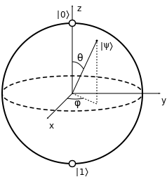
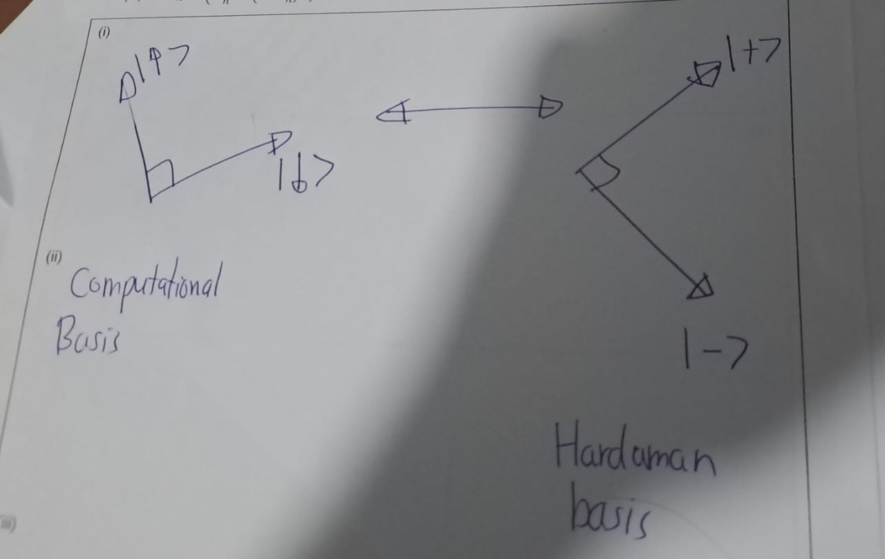
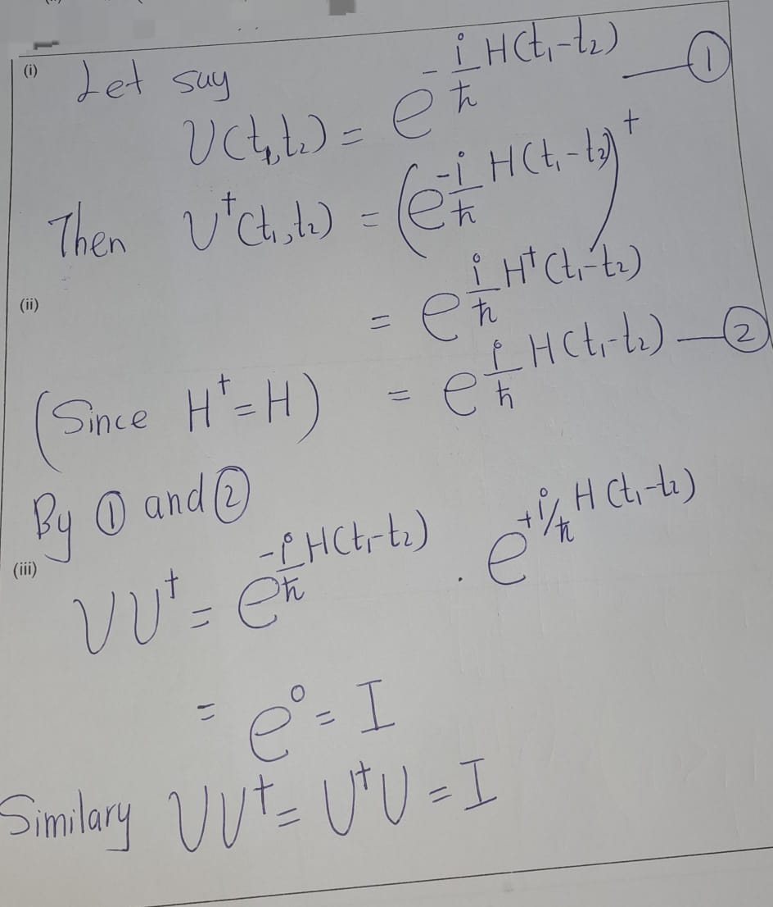
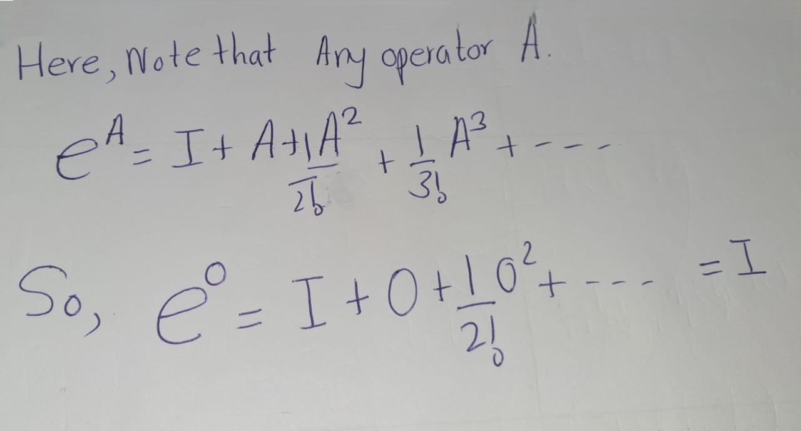
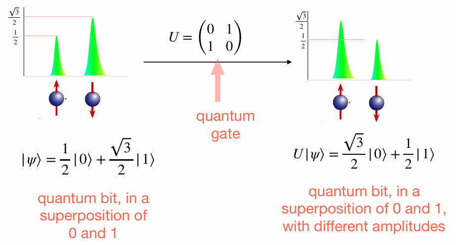
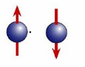

# Quntum Effects


## Superposition

<figure style="float: right; width: 15%;">
  
  <figcaption>Paul Dirac (Resource: Wikipedia)</figcaption>
</figure>


A pure state in quantum mechanics is represented in terms of a normalised vector is $|\psi\rangle$ in a complex inner product space $\mathcal{H}$ (called Hilbert space).

The notation $|\psi\rangle$ is used for quantum states, represented by column vectors, and it is called a **ket** vector; while the conjugate transpose of the  $|\psi\rangle$  is called the **bra** vector $(\langle\psi|)$, leading to bra-ket, known as **Dirac notation**.

Inner product $(\psi,\phi)$ is expressed as $\langle\psi|\phi\rangle$. Accordingly, the normalisation condition can be stated as $\langle\psi|\psi\rangle = 1$.

|ket vector|bra vector|
|:--------:|:--------:|
|$| \psi \rangle = \begin{pmatrix} a \\ b \end{pmatrix}$|$\langle\psi| = \begin{pmatrix} \bar{a} & \bar{b} \end{pmatrix}$


```{remark}
\[\langle \psi_1 | \psi_2 \rangle = \overline{\langle \psi_2 | \psi_1 \rangle}\]
```

Accordingly, it is possible to handle inner and outer products conveniently.

\[| \psi \rangle \langle \phi | = \begin{pmatrix} a\bar{c} & a \bar{d} \\ b\bar{c} & b \bar{d} \end{pmatrix}\]
where $| \psi \rangle = \begin{pmatrix} a \\ b \end{pmatrix}$ and
$| \phi \rangle = \begin{pmatrix} c \\ d \end{pmatrix}$ 

We refer to the Euclidean norm when defining the sizes of vectors. That is, \[|| \psi || = | \langle \psi | \psi \rangle |.\]

If the two states $|\psi_1\rangle$ and $|\psi_2\rangle$ are physical states of the system, then their linear superposition $c_1 |\psi_1\rangle + c_2 |\psi_1\rangle$ is also a possible state of the same system, where $c_1$ and $c_2$ are complex numbers satisfying $| c_1 |^2 + | c_2 |^2 = 1$.

This is called the **superposition principle**, and is extendable to any number of states, by considering appropriate basis states.


- A single-qubit quantum state is represented as:
     $$ |\psi\rangle = \alpha |0\rangle + \beta |1\rangle, $$
     where \( \alpha, \beta \in \mathbb{C} \), and \( |\alpha|^2 + |\beta|^2 = 1 \) (normalization condition).

- The state can also be parameterized in terms of angles:
     $$ |\psi\rangle = \cos{\frac{\theta}{2}} |0\rangle + e^{i\phi} \sin{\frac{\theta}{2}} |1\rangle, $$
     where:
     - \( \theta \in [0, \pi] \): Determines the weight of \( |0\rangle \) and \( |1\rangle \).
     - \( \phi \in [0, 2\pi) \): Defines the relative phase between \( |0\rangle \) and \( |1\rangle \).
     

- The angles \( (\theta, \phi) \) represent a unique point on the unit sphere in \( \mathbb{R}^3 \), called the **Bloch Sphere**.
- The quantum state \( |\psi\rangle \) corresponds to a point \( \mathbf{r} \) on the Bloch sphere:
     $$ \mathbf{r} = (\langle \sigma_x \rangle, \langle \sigma_y \rangle, \langle \sigma_z \rangle), $$
     where the components are:
     - \( \langle \sigma_x \rangle = \sin{\theta} \cos{\phi} \),
     - \( \langle \sigma_y \rangle = \sin{\theta} \sin{\phi} \),
     - \( \langle \sigma_z \rangle = \cos{\theta} \).     
    
<center>
  
</center>
     
 This defines a one-to-one correspondence between quantum states
 (up to a global phase) (\(e^{i\gamma} |\psi\rangle\)) and points on the unit sphere.
 
 
 
 ```{remark}
 The global phase does not change the Bloch sphere
 representation. That is, states differing by a global phase represent
 the same physical qubit state.     
 ```    
     

Consider an electron that has either spin up or down. We now state the states with respect to the basis up $|↑\rangle$ and down $|↓\rangle$ states.


A possible state of the electron
\[| \psi \rangle = \sqrt{\frac{2}{3}} | ↑ \rangle + \frac{i}{\sqrt{3}} | ↓ \rangle\]
because 
\(
\left| \sqrt{\frac{2}{3}} \right|^2 + \left| \frac{i}{\sqrt{3}} \right|^2 = \frac{2}{3} + \frac{1}{3} = 1
\)


## Measurement


In quantum mechanics, there is an operator corresponding to each dynamical observable of classical physics, such as position, momentum, spin, etc. This operator is mathematically expressed by a Hermitian matrix acting on the Hilbert space $\mathcal{H}$.

Let $a$ be an observable and $A$ be the corresponding Hermitian operator acting on the Hilbert space $\mathcal{H}$. When $a$ is measured, one of the eigenvalues of $A$ is obtained, and the system suddenly changes to the corresponding eigenstate.

Eigenvalues of Hermitian matrices are real and eigenvectors corresponding to different eigenvalues are orthogonal. The system collapses to state $|\lambda_1\rangle$ and we obtain the eigenvalue $\lambda_1$:
\[c_1|\lambda_1\rangle + c_2|\lambda_2\rangle \rightarrow |\lambda_1\rangle\]

Or, to state $|\lambda_2\rangle$ and we obtain the eigenvalue $\lambda_2$:
\[c_1|\lambda_1\rangle + c_2|\lambda_2\rangle \rightarrow |\lambda_2\rangle\]


\[|↑\rangle = \begin{pmatrix} 1 \\ 0 \end{pmatrix},
|↓\rangle = \begin{pmatrix} 0 \\ 1 \end{pmatrix}.\]

Corresponding spin operator (Hermitian matrix) (Pauli z-matrix):
$\sigma_z = \begin{pmatrix} 1 & 0 \\ 0 & -1 \end{pmatrix}$


Eigenstates $|↑\rangle$ and $|↓\rangle$, with eigenvalues $\pm 1$:
$$\sigma_z|↑\rangle = |↑\rangle,\sigma_z|↓\rangle = -|↓\rangle$$


A quantum measurement is described by a set of measurement operators $\{M_a\}$, which operate on the state of the system. Consider:
$|\psi\rangle = c_1|\lambda_1\rangle + c_2|\lambda_2\rangle$.

The probability of collapsing to state $|\lambda_i\rangle$ is given by $|c_i|^2$.

Note that $|c_1|^2 + |c_2|^2 = 1$.Therefore, $c_1$ and $c_2$ are called probability amplitudes.

```{example}


Consider 
\[\psi\rangle = \frac{2}{3}|↑\rangle + \frac{i}{3}|↓\rangle\]


- Probability of collapsing to spin-up: $\frac{2}{3}$
- Probability of collapsing to spin-down: $\frac{1}{3}$
```


This is also stated as follows in another approach: Consider an experimental setup which is described by an observable $a$ (with corresponding Hermitian operator $A$) to be measured and state $|\psi\rangle$ of the system. Then the expectation value $⟨A\rangle$ of $a$ after measurements with respect to a state $|\psi\rangle$ is given by:
$⟨A\rangle =\langle\psi|A|\psi\rangle$.


```{example}
Calculating the expectation value of \( \sigma_z \) (Pauli \( z \)-matrix) for the given state:
\[
|\psi\rangle = \sqrt{\frac{2}{3}} |0\rangle + \frac{i}{\sqrt{3}} |1\rangle.
\]
Then,
   \[
   |\psi\rangle = \sqrt{\frac{2}{3}}
   \begin{pmatrix}
   1 \\
   0
   \end{pmatrix}
   + \frac{i}{\sqrt{3}}
   \begin{pmatrix}
   0 \\
   1
   \end{pmatrix}
   =
   \begin{pmatrix}
   \sqrt{\frac{2}{3}} \\
   \frac{i}{\sqrt{3}}
   \end{pmatrix}.
   \]
\[\sigma_z|\psi\rangle=
   \begin{pmatrix}
   1 & 0 \\
   0 & -1
   \end{pmatrix}
   \begin{pmatrix}
   \sqrt{\frac{2}{3}} \\
   \frac{i}{\sqrt{3}}
   \end{pmatrix}
   =
   \begin{pmatrix}
   \sqrt{\frac{2}{3}} \\
   -\frac{i}{\sqrt{3}}
   \end{pmatrix}.
   \]

   \[
   \langle \psi | =
   \begin{pmatrix}
   \sqrt{\frac{2}{3}} & -\frac{i}{\sqrt{3}}
   \end{pmatrix}.
   \]
So,
 \[
   \langle \psi |\sigma_z|\psi\rangle
   =
   \begin{pmatrix}
   \sqrt{\frac{2}{3}} & -\frac{i}{\sqrt{3}}
   \end{pmatrix}
   \begin{pmatrix}
   \sqrt{\frac{2}{3}} \\
   -\frac{i}{\sqrt{3}}
   \end{pmatrix}=\frac{2}{3} + \frac{1}{3} = 1.
   \]
Henece, \[\text{The expectation value of } \sigma_z =
\langle \sigma_z \rangle = 1.
\]
```

Measurement can be regarded as an operation that is possible to perform with respect to any orthonormal basis. The following basis is called the Hadamard basis:
\[|+\rangle = \frac{1}{\sqrt{2}}|0\rangle + \frac{1}{\sqrt{2}}|1\rangle\]
\[|−\rangle = \frac{1}{\sqrt{2}}|1 − \rangle  \frac{1}{\sqrt{2}}|1\rangle\]


```{exercise}


\[|\psi\rangle = \frac{2}{3}|0\rangle + \frac{i}{3}|1\rangle\]

What happens if this is measured with respect to the Hadamard basis?
```



**Solution**: \
We can obtain easily 
\[
\begin{eqnarray}
|0\rangle&=\frac{1}{\sqrt{2}}\left(|+\rangle+|+\rangle\right)\\
|1\rangle&=\frac{1}{\sqrt{2}}\left(|+\rangle+|-\rangle\right)\\
\end{eqnarray}
\]
Then,
\[
\begin{eqnarray}
|\psi\rangle
&=&\frac{2}{3}|0\rangle + \frac{i}{3}|1\rangle\\
&=&\frac{2}{3}\left(\frac{1}{\sqrt{2}}\left(|+\rangle+|-\rangle\right)\right)+
\frac{i}{3}\left(\frac{1}{\sqrt{2}}\left(|+\rangle-|-\rangle\right)\right)\\
&=&\frac{1}{\sqrt{2}}\left(\frac{2+i}{3}|+\rangle+\frac{2-i}{3}|-\rangle\right)\\
&=&\frac{2+i}{3\sqrt{2}}|+\rangle+\frac{2-i}{3\sqrt{2}}|-\rangle
\end{eqnarray}
\]


## Unitary Evolution


<!---->


The time evolution of a closed quantum system is governed by the Schrödinger equation:
$$i\hbar \frac{d}{dt}|\psi(t)\rangle = H|\psi(t)\rangle$$
where:

- \( \hbar \) is the reduced Planck's constant.
- \( H \) is the Hamiltonian of the system (a Hermitian operator).


```{remark} 
The following is **a** solution to the Schrödinger equation:
\[|\psi(t_2)\rangle = e^{\frac{i H}{\hbar} (t_1 - t_2)} |\psi(t_1)\rangle.\]
```

Note that \( e^{\frac{i H}{\hbar} (t_1 - t_2)} \) is a unitary.

**Verification**:


Let say, 

\[
U(t_1, t_2) = e^{-\frac{i}{\hbar} H(t_1 - t_2)} (\#eq:eq2-1)
\]


Then,


\[
\begin{eqnarray}
U^\dagger(t_1, t_2) 
&=& \left( e^{-\frac{i}{\hbar} H(t_1 - t_2)} \right)^\dagger\\
&=& e^{\frac{i}{\hbar} H^\dagger (t_1 - t_2)}\\
&=& e^{\frac{i}{\hbar} H(t_1 - t_2)} (\#eq:eq2-2)
\end{eqnarray}
\]


(Since \( H^\dagger = H \), assuming \( H \) is Hermitian)

From equations \@ref(eq:eq2-1) and \@ref(eq:eq2-2), we have:


\[
U U^\dagger = e^{-\frac{i}{\hbar} H(t_1 - t_2)} \cdot e^{\frac{i}{\hbar} H(t_1 - t_2)}\\
= e^0 = I
\]


Similarly, it follows that:


\[
U U^\dagger = U^\dagger U = I
\]

Here, note that for any operator \( A \):


\[
e^A = I + A + \frac{A^2}{2!} + \frac{A^3}{3!} + \cdots
\]


So,


\[
e^0 = I + 0 + \frac{0^2}{2!} + \cdots = I
\]

<!-- {width=50%}
{width=50%}-->


This leads to the notion of unitary evolution of a quantum system. The gate model of quantum computing is based on this idea. A quantum gate is a unitary matrix, acting on a quantum state, called a qubit.



## Entanglement

Consider a quantum system consisting of two components; one in a Hilbert space $\mathcal{H}_1$ and the other in another Hilbert space $\mathcal{H}_2$. Then the system as a whole is in Hilbert space $\mathcal{H} = \mathcal{H}_1 \otimes \mathcal{H}_2$.

\[
|\psi\rangle =\sum_{i,j}c_{i,j}|e_{1,j}\rangle \otimes |e_{2,j}\rangle
\]

,where

- \(|\psi\rangle   \): Composite state
- \(|e_{1,j}\rangle\):  Orthonormal basis for \(\mathcal{H}_1\) 
- \(|e_{2,j}\rangle\): Orthonormal basis for  \(\mathcal{H}_2\) 


|No of bits|   |Picture|   |Orthonormal Basis|
|:--------:|:-:|:-----:|:-:|:---------------:|
|Single qubit|\(\mathcal{H_1}\)||\(|\uparrow\rangle=|0\rangle=\begin{pmatrix}1\\0\end{pmatrix}\)<br><br>\(|\downarrow\rangle=|1\rangle=\begin{pmatrix}0\\1\end{pmatrix}\)|\(|0\rangle,|1\rangle\)|\\
|Two qubits |\(\mathcal{H}_1\)<br> <br> <br> \(\mathcal{H}_2\)|<br>|\(\longleftarrow|0\rangle,|1\rangle\) <br> <br> <br> \(\longleftarrow|0\rangle,|1\rangle\)|\[\begin{eqnarray}
\mathcal{H}=
\mathcal{H}_1& \otimes & \mathcal{H}_2\\
|0\rangle  & \otimes & |0\rangle\\
|0\rangle  & \otimes & |1\rangle\\
|1\rangle  & \otimes & |0\rangle\\
|1\rangle  & \otimes & |1\rangle
\end{eqnarray}
\]|

Consider a quantum system composed of two components; one in a Hilbert space \( \mathcal{H}_1 \) and the other in another Hilbert space \( \mathcal{H}_2 \). 

Then, the system as a whole is in the Hilbert space \( \mathcal{H} = \mathcal{H}_1 \otimes \mathcal{H}_2 \).


\[\begin{eqnarray}
|00 \rangle &:=& |0 \rangle \otimes |0 \rangle =\begin{pmatrix} 1 \\0 \end{pmatrix}\otimes \begin{pmatrix} 1 \\0 \end{pmatrix}=\begin{pmatrix} 1\\0\\0\\0 \end{pmatrix}\\\\ 
|01 \rangle &:=& |0 \rangle \otimes |1 \rangle =\begin{pmatrix} 1 \\0 \end{pmatrix}\otimes \begin{pmatrix} 0 \\1 \end{pmatrix} =\begin{pmatrix} 0\\1\\0\\0 \end{pmatrix}\\\\ 
|10 \rangle &:=& |1 \rangle \otimes |0 \rangle =\begin{pmatrix} 0 \\1 \end{pmatrix}\otimes \begin{pmatrix} 0 \\1 \end{pmatrix}=\begin{pmatrix} 0\\0\\1\\0 \end{pmatrix}\\\\ 
|11 \rangle &:=& |1 \rangle \otimes |1 \rangle =\begin{pmatrix} 0 \\1 \end{pmatrix}\otimes \begin{pmatrix} 0 \\1 \end{pmatrix}=\begin{pmatrix} 0\\0\\0\\1 \end{pmatrix}\\\\ 
\end{eqnarray}\]

```{example}
**Example of Two-qubit state**
\[
|\psi\rangle = \frac{1}{2}|00\rangle + \frac{1}{2}|01\rangle + \frac{1}{2}|10\rangle + \frac{1}{2}|11\rangle
\]

A composite state that can be written as a tensor product of 
two vectors as \(|\psi\rangle = |\psi_1  \rangle \otimes |\psi_2\) \rangle is called a **separable state**
\[\begin{eqnarray}
\psi\rangle &=& \frac{1}{2}|00\rangle + \frac{1}{2}|01\rangle + \frac{1}{2}|10\rangle + \frac{1}{2}|11\rangle \\
&=& \underbrace{\frac{1}{\sqrt{2}}|0\rangle + \frac{1}{\sqrt{2}}|1\rangle}_{|\psi_1\rangle}  \otimes  \underbrace{\frac{1}{\sqrt{2}}|0\rangle + \frac{1}{\sqrt{2}}|1\rangle}_{|\psi_2\rangle}  \\
&=& |\psi_1\rangle \otimes |\psi_2\rangle
\end{eqnarray}\]

|   |   |
|:-:|:-:|
|\(|\psi_1\rangle\)|{height=10%}|\\
|\(|\psi_2\rangle\)|{height=10%}|
```


There are quantum states in the Hilbert space \(\mathcal{H}_1\otimes \mathcal{H}_2\) that cannot be stated as a product!

```{exercise}
Show that the following is such a state:
\[
|\psi\rangle = \frac{1}{\sqrt{2}}|00\rangle + \frac{1}{\sqrt{2}}|11\rangle
\]
```


A product state for a quantum system in \( H_1 \otimes H_2 \) can be written as:
\[
|\psi\rangle = |\psi_1\rangle \otimes |\psi_2\rangle
\]
where
\[
|\psi_1\rangle = a|0\rangle + b|1\rangle, \quad |\psi_2\rangle = c|0\rangle + d|1\rangle
\]
with \( a, b, c, d \) being complex coefficients satisfying the normalization conditions:
\[
|a|^2 + |b|^2 = 1 \quad \text{and} \quad |c|^2 + |d|^2 = 1.
\]


Expanding the tensor product \( |\psi_1\rangle \otimes |\psi_2\rangle \):
\[
|\psi_1\rangle \otimes |\psi_2\rangle = (a|0\rangle + b|1\rangle) \otimes (c|0\rangle + d|1\rangle)
\]
\[
= ac|00\rangle + ad|01\rangle + bc|10\rangle + bd|11\rangle
\]

This means that any product state must have coefficients \( ac, ad, bc, bd \) for the respective basis states \( |00\rangle, |01\rangle, |10\rangle, |11\rangle \), which are all factorizable in terms of \( a, b, c, d \).


For the given state:
\[
|\psi\rangle = \frac{1}{\sqrt{2}}|00\rangle + \frac{1}{\sqrt{2}}|11\rangle
\]

The coefficients are:
\[
\text{Coefficient of } |00\rangle = \frac{1}{\sqrt{2}}, \quad \text{Coefficient of } |11\rangle = \frac{1}{\sqrt{2}}
\]
\[
\text{Coefficient of } |01\rangle = 0, \quad \text{Coefficient of } |10\rangle = 0
\]


For the state to be a product state, there must exist \( a, b, c, d \) such that:
\[
ac = \frac{1}{\sqrt{2}}, \quad ad = 0, \quad bc = 0, \quad bd = \frac{1}{\sqrt{2}}
\]

From \( ad = 0 \), either \( a = 0 \) or \( d = 0 \). Similarly, from \( bc = 0 \), either \( b = 0 \) or \( c = 0 \). However:
1. If \( a = 0 \), then \( ac \neq \frac{1}{\sqrt{2}} \), which is a contradiction.
2. If \( b = 0 \), then \( bd \neq \frac{1}{\sqrt{2}} \), which is also a contradiction.

Thus, no combination of \( a, b, c, d \) can satisfy all the conditions simultaneously.


Since the given state cannot be written as \( |\psi_1\rangle \otimes |\psi_2\rangle \), it is **not a product state**. Therefore, the state 
\[
|\psi\rangle = \frac{1}{\sqrt{2}}|00\rangle + \frac{1}{\sqrt{2}}|11\rangle
\]
is an **entangled state**.


