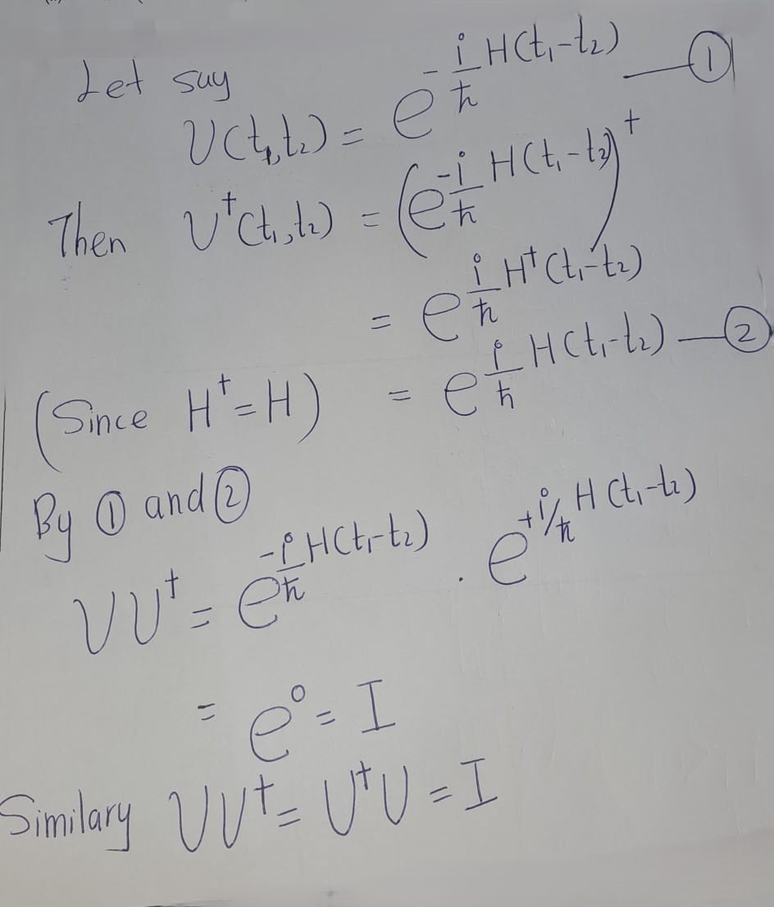

# Quntum Effects

## Superposition


A pure state in quantum mechanics is represented in terms of a normalised vector is $|\psi\rangle$ in a complex inner product space $\mathcal{H}$ (called Hilbert space).

The notation $|\psi\rangle$ is used for quantum states, represented by column vectors, and it is called a **ket** vector; while the conjugate transpose of the  $|\psi\rangle$  is called the **bra** vector $(\langle\psi|)$, leading to bra-ket, known as **Dirac notation**.

Inner product $(\psi,\phi)$ is expressed as $\langle\psi|\phi\rangle$. Accordingly, the normalisation condition can be stated as $\langle\psi|\psi\rangle = 1$.

|ket vector|bra vector|
|:--------:|:--------:|
|$| \psi \rangle = \begin{pmatrix} a \\ b \end{pmatrix}$|$\langle\psi| = \begin{pmatrix} \bar{a} & \bar{b} \end{pmatrix}$


```{remark}
\[\langle \psi_1 | \psi_2 \rangle = \overline{\langle \psi_2 | \psi_1 \rangle}\]
```

Accordingly, it is possible to handle inner and outer products conveniently.

\[| \psi \rangle \langle \phi | = \begin{pmatrix} a\bar{c} & a \bar{d} \\ b\bar{c} & b \bar{d} \end{pmatrix}\]
where $| \psi \rangle = \begin{pmatrix} a \\ b \end{pmatrix}$ and
$| \phi \rangle = \begin{pmatrix} c \\ d \end{pmatrix}$ 

We refer to the Euclidean norm when defining the sizes of vectors. That is, \[|| \psi || = | \langle \psi | \psi \rangle |.\]

If the two states $|\psi_1\rangle$ and $|\psi_2\rangle$ are physical states of the system, then their linear superposition $c_1 |\psi_1\rangle + c_2 |\psi_1\rangle$ is also a possible state of the same system, where $c_1$ and $c_2$ are complex numbers satisfying $| c_1 |^2 + | c_2 |^2 = 1$.

This is called the **superposition principle**, and is extendable to any number of states, by considering appropriate basis states.

Consider an electron that has either spin up or down. We now state the states with respect to the basis up $|↑\rangle$ and down $|↓\rangle$ states.


A possible state of the electron
\[| \psi \rangle = \sqrt{\frac{2}{3}} | ↑ \rangle + \frac{i}{\sqrt{3}} | ↓ \rangle\]
because 
\(
\left| \sqrt{\frac{2}{3}} \right|^2 + \left| \frac{i}{\sqrt{3}} \right|^2 = \frac{2}{3} + \frac{1}{3} = 1
\)


## Measurement


In quantum mechanics, there is an operator corresponding to each dynamical observable of classical physics, such as position, momentum, spin, etc. This operator is mathematically expressed by a Hermitian matrix acting on the Hilbert space $\mathcal{H}$.

Let $a$ be an observable and $A$ be the corresponding Hermitian operator acting on the Hilbert space $\mathcal{H}$. When $a$ is measured, one of the eigenvalues of $A$ is obtained, and the system suddenly changes to the corresponding eigenstate.

Eigenvalues of Hermitian matrices are real and eigenvectors corresponding to different eigenvalues are orthogonal. The system collapses to state $|\lambda_1\rangle$ and we obtain the eigenvalue $\lambda_1$:
\[c_1|\lambda_1\rangle + c_2|\lambda_2\rangle \rightarrow |\lambda_1\rangle\]

Or, to state $|\lambda_2\rangle$ and we obtain the eigenvalue $\lambda_2$:
\[c_1|\lambda_1\rangle + c_2|\lambda_2\rangle \rightarrow |\lambda_2\rangle\]


\[|↑\rangle = \begin{pmatrix} 1 \\ 0 \end{pmatrix},
|↓\rangle = \begin{pmatrix} 0 \\ 1 \end{pmatrix}.\]

Corresponding spin operator (Hermitian matrix) (Pauli z-matrix):
$\sigma_z = \begin{pmatrix} 1 & 0 \\ 0 & -1 \end{pmatrix}$


Eigenstates $|↑\rangle$ and $|↓\rangle$, with eigenvalues $\pm 1$:
$$\sigma_z|↑\rangle = |↑\rangle,\sigma_z|↓\rangle = -|↓\rangle$$


A quantum measurement is described by a set of measurement operators $\{M_a\}$, which operate on the state of the system. Consider:
$|\psi\rangle = c_1|\lambda_1\rangle + c_2|\lambda_2\rangle$.

The probability of collapsing to state $|\lambda_i\rangle$ is given by $|c_i|^2$.

Note that $|c_1|^2 + |c_2|^2 = 1$.Therefore, $c_1$ and $c_2$ are called probability amplitudes.

```{example}


Consider 
\[\psi\rangle = \frac{2}{3}|↑\rangle + \frac{i}{3}|↓\rangle\]


- Probability of collapsing to spin-up: $\frac{2}{3}$
- Probability of collapsing to spin-down: $\frac{1}{3}$
```


This is also stated as follows in another approach: Consider an experimental setup which is described by an observable $a$ (with corresponding Hermitian operator $A$) to be measured and state $|\psi\rangle$ of the system. Then the expectation value $⟨A\rangle$ of $a$ after measurements with respect to a state $|\psi\rangle$ is given by:
$⟨A\rangle =\langle\psi|A|\psi\rangle$.


```{example}
Calculating the expectation value of \( \sigma_z \) (Pauli \( z \)-matrix) for the given state:
\[
|\psi\rangle = \sqrt{\frac{2}{3}} |0\rangle + \frac{i}{\sqrt{3}} |1\rangle.
\]
Then,
   \[
   |\psi\rangle = \sqrt{\frac{2}{3}}
   \begin{pmatrix}
   1 \\
   0
   \end{pmatrix}
   + \frac{i}{\sqrt{3}}
   \begin{pmatrix}
   0 \\
   1
   \end{pmatrix}
   =
   \begin{pmatrix}
   \sqrt{\frac{2}{3}} \\
   \frac{i}{\sqrt{3}}
   \end{pmatrix}.
   \]
\[\sigma_z|\psi\rangle=
   \begin{pmatrix}
   1 & 0 \\
   0 & -1
   \end{pmatrix}
   \begin{pmatrix}
   \sqrt{\frac{2}{3}} \\
   \frac{i}{\sqrt{3}}
   \end{pmatrix}
   =
   \begin{pmatrix}
   \sqrt{\frac{2}{3}} \\
   -\frac{i}{\sqrt{3}}
   \end{pmatrix}.
   \]

   \[
   \langle \psi | =
   \begin{pmatrix}
   \sqrt{\frac{2}{3}} & -\frac{i}{\sqrt{3}}
   \end{pmatrix}.
   \]
So,
 \[
   \langle \psi |\sigma_z|\psi\rangle
   =
   \begin{pmatrix}
   \sqrt{\frac{2}{3}} & -\frac{i}{\sqrt{3}}
   \end{pmatrix}
   \begin{pmatrix}
   \sqrt{\frac{2}{3}} \\
   -\frac{i}{\sqrt{3}}
   \end{pmatrix}=\frac{2}{3} + \frac{1}{3} = 1.
   \]
Henece, \[\text{The expectation value of } \sigma_z =
\langle \sigma_z \rangle = 1.
\]
```

Measurement can be regarded as an operation that is possible to perform with respect to any orthonormal basis. The following basis is called the Hadamard basis:
\[|+\rangle = \frac{1}{\sqrt{2}}|0\rangle + \frac{1}{\sqrt{2}}|1\rangle\]
\[|−\rangle = \frac{1}{\sqrt{2}}|1 − \rangle  \frac{1}{\sqrt{2}}|1\rangle\]


```{exercise}


\[|\psi\rangle = \frac{2}{3}|0\rangle + \frac{i}{3}|1\rangle\]

What happens if this is measured with respect to the Hadamard basis?
```


**Solution**: \
We can obtain easily 
\[
\begin{eqnarray}
|0\rangle&=\frac{1}{\sqrt{2}}\left(|+\rangle+|+\rangle\right)\\
|1\rangle&=\frac{1}{\sqrt{2}}\left(|+\rangle+|-\rangle\right)\\
\end{eqnarray}
\]
Then,
\[
\begin{eqnarray}
|\psi\rangle
&=&\frac{2}{3}|0\rangle + \frac{i}{3}|1\rangle\\
&=&\frac{2}{3}\left(\frac{1}{\sqrt{2}}\left(|+\rangle+|-\rangle\right)\right)+
\frac{i}{3}\left(\frac{1}{\sqrt{2}}\left(|+\rangle-|-\rangle\right)\right)\\
&=&\frac{1}{\sqrt{2}}\left(\frac{2+i}{3}|+\rangle+\frac{2-i}{3}|-\rangle\right)\\
&=&\frac{2+i}{3\sqrt{2}}|+\rangle+\frac{2-i}{3\sqrt{2}}|-\rangle
\end{eqnarray}
\]


## Unitary Evolution
<!---

--->


The time evolution of a closed quantum system is governed by the Schrödinger equation:
$$i\hbar \frac{d}{dt}|\psi(t)⟩ = H|\psi(t)⟩$$
where:
- \( \hbar \) is the reduced Planck's constant.
- \( H \) is the Hamiltonian of the system (a Hermitian operator).


```{remark} 
The following is **a** solution to the Schrödinger equation:
\[|\psi(t_2)\rangle = e^{\frac{i H}{\hbar} (t_1 - t_2)} |\psi(t_1)\rangle.\]
```

Note that \( e^{\frac{i H}{\hbar} (t_1 - t_2)} \) is a unitary.

**Verfication**\
{width=50%}
{width=50%}

This leads to the notion of unitary evolution of a quantum system. The gate model of quantum computing is based on this idea. A quantum gate is a unitary matrix, acting on a quantum state, called a qubit.


## Entanglement

Consider a quantum system consisting of two components; one in a Hilbert space $\mathcal{H}_1$ and the other in another Hilbert space $\mathcal{H}_2$. Then the system as a whole is in Hilbert space $\mathcal{H} = \mathcal{H}_1 \otimes \mathcal{H}_2$.

\[
|\psi\rangle =\sum_{i,j}c_{i,j}|e_{1,j}\rangle \otimes |e_{2,j}\rangle
\]

,where

- \(|\psi\rangle   \): Composite state
- \(|e_{1,j}\rangle\):  Orthonormal basis for \(\mathcal{H}_1\) 
- \(|e_{2,j}\rangle\): Orthonormal basis for  \(\mathcal{H}_2\) 

|single qubit||\(|\uparrow\rangle=|0\rangle=\begin{pmatrix}1\\0\end{pmatrix}\)|\(|\downarrow\rangle=|1\rangle=\begin{pmatrix}0\\1\end{pmatrix}\)|
|-----------------|-----------------------------------------------------|-------------------------------------------------------|

