# Quantum Gates

## Single Qubit Gates 

Action of an arbitrary single qubit quantum gate:

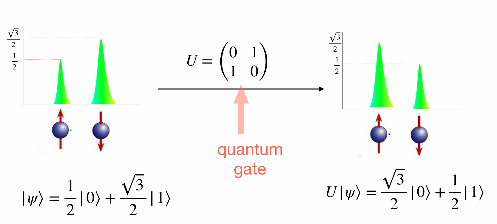

**Notation**: 
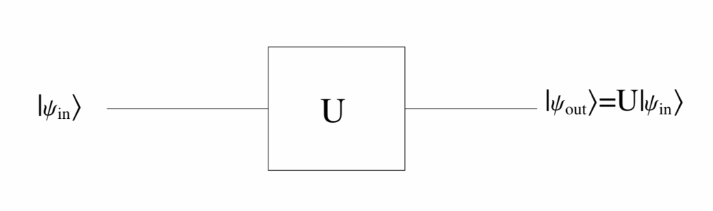

**Outer Product Notation**:

Suppose a single-qubit quantum gate \( A \) transforms \( |0\rangle \) into \( |\psi_0\rangle \) and \( |1\rangle \) into \( |\psi_1\rangle \). Then the outer product representation of \( A \) is given by:


\[
A = |\psi_0\rangle\langle 0| + |\psi_1\rangle\langle 1|.
\]


### Hadamard gate

Hadamard gate is of particular importance, as it enables Hadamard transformation.


The Hadamard gate is represented as:


\[
H = \frac{1}{\sqrt{2}}
\begin{pmatrix}
1 & 1 \\
1 & -1
\end{pmatrix}
\]

The Hadamard gate transforms basis states as follows:


\[
\begin{eqnarray}
H|0\rangle &=& \frac{1}{\sqrt{2}}
\begin{pmatrix}
1 & 1 \\
1 & -1
\end{pmatrix}
\begin{pmatrix}
1 \\
0
\end{pmatrix}
= \frac{1}{\sqrt{2}}
\begin{pmatrix}
1 \\
1
\end{pmatrix}
= \frac{1}{\sqrt{2}} (|0\rangle + |1\rangle)(\#eq:eq1)\\
H|1\rangle &=& \frac{1}{\sqrt{2}}
\begin{pmatrix}
1 & 1 \\
1 & -1
\end{pmatrix}
\begin{pmatrix}
0 \\
1
\end{pmatrix}
= \frac{1}{\sqrt{2}}
\begin{pmatrix}
1 \\
-1
\end{pmatrix}
= \frac{1}{\sqrt{2}} (|0\rangle - |1\rangle)(\#eq:eq2)
\end{eqnarray}
\]


The computational basis \(\{|0\rangle, |1\rangle\}\) is mapped to the Hadamard basis \(\{|+\rangle,|-\rangle)


<center>
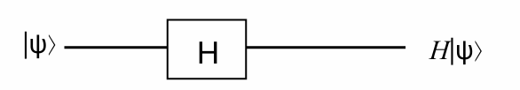
</center>


Hadamard gate is often used in quantum algorithms to make equal superposition of states.

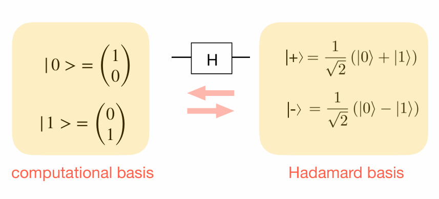

```{exercise}
What is the outer product representation of the Hadamard gate?

```
**Solution**\


The outer product representation of the Hadamard gate can be expressible as:


\[
H|x\rangle=|+\rangle \langle 0| + |-\rangle\langle 1|
\]

Further, By \@ref(eq:eq1) and \@ref(eq:eq2) we get,

\[
H|x\rangle=\frac{1}{\sqrt{2}} \big(|0\rangle + (-1)^x |1\rangle\big)
\]


In compact form, the action of Hadamard gate can be
expressed as
\[
H=\frac{1}{\sqrt{2}}\sum_{x,y\in\{0,1\}}(-1)^{xy} |x\rangle  \langle y|.
\]


The effect of \( H \) on a 1-qubit basis state \( |x\rangle \) (where \( x = 0 \) or \( 1 \)) can be summarized as follows:


\[
H|x\rangle = \frac{1}{\sqrt{2}} \left( |0\rangle + (-1)^x |1\rangle \right) = \frac{1}{\sqrt{2}} \sum_{k=0}^1 (-1)^{k x} |k\rangle
\]


This is consistent with our previous definition. If we apply \( H^{\otimes q} \) on a \( q \)-qubit basis state \( |x_q\rangle \), we obtain:


\[
\begin{eqnarray}
H^{\otimes q} |\vec{x}\rangle_q &=& \frac{1}{\sqrt{2^q}} \sum_{k_1=0}^1 \cdots \sum_{k_q=0}^1 (-1)^{\sum_{h=1}^q k_h \vec{x_h}} |k_1 \rangle_1\otimes  \cdots |k_q\rangle_1\\
&=& \frac{1}{\sqrt{2^q}} \sum_{k \in \{0,1\}^q} (-1)^{\vec{k} \bullet \vec{x}} |\vec{k}\rangle_q
\end{eqnarray}
\]

,where \(\bullet\)is the bit wise dot product.


When considering multiple Hadamard gates in parallel, we will also make use of the following relationship, which can be easily verified using the definition:

\[H^{\otimes q} = \frac{1}{2} \begin{pmatrix} H^{\otimes q-1} & H^{\otimes q-1} \\ H^{\otimes q-1} & -H^{\otimes q-1} \end{pmatrix}\]

The next proposition shows one of the reasons why the Hadamard gate is frequently employed in many quantum algorithms.


```{proposition}
Given a $q$-qubit quantum computing device initially in the state $|0\rangle_q$, applying the Hadamard gate to all qubits, or equivalently the matrix $H^{\otimes q}$, yields the uniform superposition of basis states $\frac{1}{\sqrt{2^q}} \sum_{\vec{j}\in\{0,1\}^q} |\vec{j}\rangle$.
```

```{proof}
We have:
\begin{eqnarray}
H^{\otimes q}|0\rangle_q 
&=& H^{\otimes q}|0\rangle^{\otimes q}\\
&=&(H \otimes \cdots \otimes H)(|0\rangle \otimes |0\rangle)\\
&=& (H|0\rangle ) \otimes \cdots \otimes (H|0\rangle)\\
&=& (H|0\rangle)^{\otimes q} \\
&=& \left(\frac{1}{\sqrt{2}}|0\rangle + \frac{1}{\sqrt{2}}|1\rangle\right)^{\otimes q}\\ 
&=& \frac{1}{\sqrt{2^q}} \sum_{\vec{j}\in\{0,1\}^q} |\vec{j}\rangle.
\end{eqnarray}
```


```{remark}
The uniform superposition of the $2^q$ basis states on $q$ qubits can be obtained from the initial state $|0\rangle_q$ by applying $q$ gates only.
```


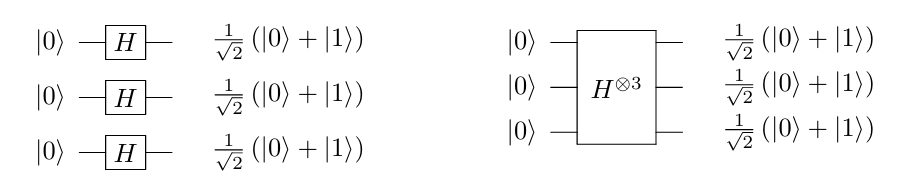


The multiple Hadamard can be represented by one of the equivalent circuits given in the figure above.


### Pauli gates 

As in classical gates, there is a \textbf{NOT gate} in quantum computing.

The role of a quantum NOT gate is transforming \( |0\rangle \) into \( |1\rangle \) and \( |1\rangle \) to \( |0\rangle \).

It turns out that the Pauli x-matrix does this task. Therefore, the corresponding gate is called \textbf{Pauli x-gate} as well.


\[
X = \sigma_x = \begin{pmatrix} 0 & 1 \\ 1 & 0 \end{pmatrix}
\]


```{exercise}
What is the Outer-product representation of the Pauli $X$-gate?
```

**Solution**:\
\[
\sigma_x= |0\rangle\langle 1| + |1\rangle\langle 0|.
\]

The other Pauli matrices are also used as quantum gates, defining the Pauli Y-gate and Pauli Z-gate as follows:


\[
Y = \sigma_y = 
\begin{pmatrix}
0 & -i \\
i & 0
\end{pmatrix}
\]

<center>
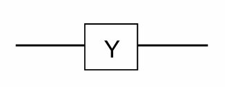
</center>


\[
Z = \sigma_z = 
\begin{pmatrix}
1 & 0 \\
0 & -1
\end{pmatrix}
\] 

<center>
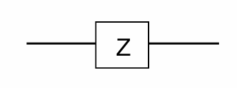
</center>


```{proposition}
The Pauli gates form a basis for \(\mathbb{C}^{2\times 2}\), they are Hermitian, and they satisfy the relationship \(XYZ=iI\).
```

```{proof}
**Claim 1: The Pauli matrices form a basis for $\mathbb{C}^{2\times 2}$ **

**Linear Independece**\
Suppose there exist scalars \(\alpha,\beta,\gamma,\delta\in\mathbb{C}\) such that
$\alpha I + \beta X + \gamma Y + \delta Z = 0$.


Then,
\[
\begin{eqnarray}
\alpha I + \beta X + \gamma Y + \delta Z &=& 0 \\
\alpha\begin{pmatrix} 1 & 0 \\ 0 & 1 \end{pmatrix} + \beta\begin{pmatrix} 0 & 1 \\ 1 & 0 \end{pmatrix} + \gamma\begin{pmatrix} 0 & -i \\ i & 0 \end{pmatrix} + \delta\begin{pmatrix} 1 & 0 \\ 0 & -1 \end{pmatrix} &=& \begin{pmatrix} 0 & 0 \\ 0 & 0 \end{pmatrix}\\
\begin{pmatrix} \alpha + \delta & \beta - i\gamma \\ \beta + i\gamma & \alpha - \delta \end{pmatrix} &=& \begin{pmatrix} 0 & 0 \\ 0 & 0 \end{pmatrix}
\end{eqnarray}
\]

This implies  $\alpha = \beta = \gamma = \delta = 0$ is the only solution, proving that the Pauli matrices are linearly independent.

**Spaning**\
  
Let $A = \begin{pmatrix} a & b \ c & d \end{pmatrix}$ be an arbitrary matrix in $\mathbb{C}^{2\times 2}$.

I need to find coefficients $\alpha, \beta, \gamma, \delta$ such that: $A = \alpha I + \beta X + \gamma Y + \delta Z$

\begin{eqnarray}
A &=& \alpha I + \beta X + \gamma Y + \delta Z \\
\begin{pmatrix} a & b \\ c & d \end{pmatrix} &=& \alpha\begin{pmatrix} 1 & 0 \\ 0 & 1 \end{pmatrix} + \beta\begin{pmatrix} 0 & 1 \\ 1 & 0 \end{pmatrix} + \gamma\begin{pmatrix} 0 & -i \\ i & 0 \end{pmatrix} + \delta\begin{pmatrix} 1 & 0 \\ 0 & -1 \end{pmatrix} \\
\begin{pmatrix} a & b \\ c & d \end{pmatrix}
&=& \begin{pmatrix} \alpha + \delta & \beta - i\gamma \\ \beta + i\gamma & \alpha - \delta \end{pmatrix}
\end{eqnarray}


This gives,
\[\alpha = \frac{a + d}{2},\delta = \frac{a - d}{2},\beta = \frac{b + c}{2},\gamma = \frac{c - b}{2i}\]

These equations always have a unique solution for any complex values of $a, b, c, d$. Therefore, any $2 \times 2$ complex matrix can be expressed as a linear combination of the Pauli matrices, proving they form a basis for $\mathbb{C}^{2\times 2}$.

Therefore, the Pauli matrices form a basis for $\mathbb{C}^{2\times 2}$.

**Claiam 2: The Pauli matrices are Hermitian**


\[
\begin{align}
I^{\dagger} &= \begin{pmatrix} 1 & 0 \\ 0 & 1 \end{pmatrix}^{\dagger} = \begin{pmatrix} 1 & 0 \\ 0 & 1 \end{pmatrix} = I\\
X^{\dagger} &= \begin{pmatrix} 0 & 1 \\ 1 & 0 \end{pmatrix}^{\dagger} = \begin{pmatrix} 0 & 1 \\ 1 & 0 \end{pmatrix} = X\\
Y^{\dagger} &= \begin{pmatrix} 0 & -i \\ i & 0 \end{pmatrix}^{\dagger} = \begin{pmatrix} 0 & \overline{i} \\ \overline{-i} & 0 \end{pmatrix} = \begin{pmatrix} 0 & -i \\ i & 0 \end{pmatrix} = Y\\
Z^{\dagger} &= \begin{pmatrix} 1 & 0 \\ 0 & -1 \end{pmatrix}^{\dagger} = \begin{pmatrix} 1 & 0 \\ 0 & -1 \end{pmatrix} = Z
\end{align}
\]
Therefore, all four Pauli matrices are Hermitian.

**Claim 3: The Pauli matrices satisfy $XYZ = iI$**

\[
\begin{eqnarray}
(XY)Z &=& \left(\begin{pmatrix} 0 & 1 \\ 1 & 0 \end{pmatrix} \begin{pmatrix} 0 & -i \\ i & 0 \end{pmatrix}\right)\begin{pmatrix} 1 & 0 \\ 0 & -1 \end{pmatrix}\\
&=& \begin{pmatrix} i & 0 \\ 0 & -i \end{pmatrix} \begin{pmatrix} 1 & 0 \\ 0 & -1 \end{pmatrix}\\ 
&=& \begin{pmatrix} i & 0 \\ 0 & i \end{pmatrix}\\
&=& i\begin{pmatrix} 1 & 0 \\ 0 & 1 \end{pmatrix} \\
&=& iI
\end{eqnarray}
\]


Thus, we have proven all three properties:
  
1. The Pauli matrices form a basis for $\mathbb{C}^{2\times 2}$
2. The Pauli matrices are Hermitian
3. The Pauli matrices satisfy $XYZ = iI$
```

### Phase flip


Recall that the global phase is not physically significant, and we are interested in changing the local phase. It is possible to define a phase flip gate performing the following operations:


\[
\begin{aligned}
|0\rangle &\rightarrow |0\rangle \\
|1\rangle &\rightarrow e^{i\phi} |1\rangle
\end{aligned}
\]


That is:


\[
P(\phi) = \begin{pmatrix}
1 & 0 \\
0 & e^{i\phi}
\end{pmatrix}.
\]


Two commonly used phase flip gates are:


\[
S = P\left(\frac{\pi}{2}\right) = \begin{pmatrix}
1 & 0 \\
0 & e^{\frac{pi}{2}}
\end{pmatrix}=
\begin{pmatrix}
1 & 0 \\
0 & i
\end{pmatrix}
\]

<center>
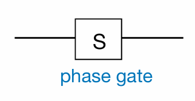
</center>


\[
T = P\left(\frac{\pi}{4}\right) = \begin{pmatrix}
1 & 0 \\
0 & e^{i\frac{\pi}{4}}
\end{pmatrix}
\]


<center>
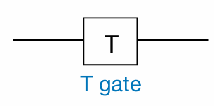
</center>

All single-qubit gates can be represented by a parameterized unitary matrix of the form:
     \[
     U(\theta, \phi, \lambda) =
     \begin{bmatrix}
     e^{i(\phi + \lambda)/2} \cos(\theta/2) & -e^{i(\phi - \lambda)/2} \sin(\theta/2) \\
     e^{i(-\phi + \lambda)/2} \sin(\theta/2) & e^{i(-\phi - \lambda)/2} \cos(\theta/2)
     \end{bmatrix}
     \]
- Here:
  - \( \theta, \phi, \lambda \) are parameters that define the gate.
  - \( e^{i\phi} \) terms introduce **phase factors**, which are essential for quantum operations.
  - Cosine and sine terms dictate the rotation of the qubit in the state space.
  
## Multi-qubit gates.

### CNOT gate

CNOT is a two-qubit gate. Controlled operations play a key role in multi-qubit gates. 

The CNOT gate is the most commonly used two-qubit controlled operation. The state of the first qubit controls whether the second qubit will be flipped or not. The first qubit is referred to as the \textbf{control qubit}, and the second qubit is called the \textbf{target qubit}.

The required transformation can be written in Dirac notation as follows:


\[
\begin{eqnarray}
|0\rangle|0\rangle & \rightarrow & |0\rangle|0\rangle, \\
|0\rangle|1\rangle & \rightarrow & |0\rangle|1\rangle, \\
|1\rangle|0\rangle & \rightarrow & |1\rangle|1\rangle, \\
|1\rangle|1\rangle & \rightarrow & |1\rangle|0\rangle.
\end{eqnarray}
\]

**Diagram**:

<center>
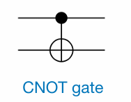
</center>


The matrix representation of the CNOT gate is:


\[
\text{CNOT} =
\begin{pmatrix}
1 & 0 & 0 & 0 \\
0 & 1 & 0 & 0 \\
0 & 0 & 0 & 1 \\
0 & 0 & 1 & 0
\end{pmatrix}.
\]


An interesting feature of the CNOT gate is that it can be used to swap two qubits. A SWAP operation between two qubits \( Q_i \) and \( Q_j \) is defined as the operation that maps a quantum state into a new quantum state where the \( i \)-th and \( j \)-th digits of every basis state are permuted. For instance, if two qubits are in a product state \( |\phi_1\rangle |\phi_2\rangle \), then:


\[
\text{SWAP}(|\phi_1\rangle |\phi_2\rangle) = |\phi_2\rangle |\phi_1\rangle
\]


Considering that the CNOT gate, like all quantum gates, is a linear map, it might seem surprising that it can implement a SWAP. However, the SWAP gate can indeed be constructed from three CNOT gates, as shown in the following circuit diagram:


<center>
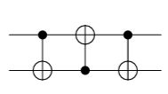
</center>

```{proposition}
The above circuit constructed with three CNOT gates swaps qubits 1 and 2.
```


```{proof}
  By linearity, it suffices to verify that the circuit maps the following basis states correctly:


\[
\begin{align}
& \text{CNOT}_{12} \text{CNOT}_{21} \text{CNOT}_{12} |00\rangle = |00\rangle, \\
& \text{CNOT}_{12} \text{CNOT}_{21} \text{CNOT}_{12} |01\rangle = |10\rangle, \\
& \text{CNOT}_{12} \text{CNOT}_{21} \text{CNOT}_{12} |10\rangle = |01\rangle, \\
& \text{CNOT}_{12} \text{CNOT}_{21} \text{CNOT}_{12} |11\rangle = |11\rangle.
\end{align}
\]


Therefore, the SWAP circuit maps:


\[
\alpha_{00}|00\rangle +
\alpha_{01}|01\rangle + 
\alpha_{10}|10\rangle +
\alpha_{11}|11\rangle 
\longrightarrow 
\alpha_{00}|00\rangle + 
\alpha_{01}|10\rangle + 
\alpha_{10}|01\rangle +
\alpha_{11}|11\rangle.
\]

```


The SWAP circuit is crucial in quantum computing due to hardware limitations. In current quantum computers, such as those using superconducting qubits, 2-qubit gates can only operate between physically adjacent qubits. However, by using SWAP gates, qubits can be virtually "moved" to adjacent locations as needed. This ensures that, as long as the qubit connectivity forms a connected graph, 2-qubit gates can effectively be applied to any pair of qubits, making all qubits theoretically able to interact. Practically, this may require additional SWAP gates but overcomes the physical adjacency constraint.


### CCNOT gate ( Toffoli gate)


\[
\begin{eqnarray}
|0\rangle|0\rangle|0\rangle & \rightarrow & |0\rangle|0\rangle|0\rangle, \\
|0\rangle|0\rangle|1\rangle & \rightarrow & |0\rangle|0\rangle|1\rangle, \\
|0\rangle|1\rangle|0\rangle & \rightarrow & |0\rangle|1\rangle|0\rangle, \\
|0\rangle|1\rangle|1\rangle & \rightarrow & |0\rangle|1\rangle|1\rangle, \\
|1\rangle|0\rangle|0\rangle & \rightarrow & |1\rangle|0\rangle|0\rangle, \\
|1\rangle|0\rangle|1\rangle & \rightarrow & |1\rangle|0\rangle|1\rangle, \\
|1\rangle|1\rangle|0\rangle & \rightarrow & |1\rangle|1\rangle|1\rangle, \\
|1\rangle|1\rangle|1\rangle & \rightarrow & |1\rangle|1\rangle|0\rangle
\end{eqnarray}
\]

Diagram:

<center>
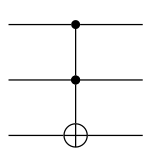
</center>

The matrix representation of the CCNOT gate is:

\[
\begin{pmatrix}
1 & 0 & 0 & 0 & 0 & 0 & 0 & 0 \\
0 & 1 & 0 & 0 & 0 & 0 & 0 & 0 \\
0 & 0 & 1 & 0 & 0 & 0 & 0 & 0 \\
0 & 0 & 0 & 1 & 0 & 0 & 0 & 0 \\
0 & 0 & 0 & 0 & 1 & 0 & 0 & 0 \\
0 & 0 & 0 & 0 & 0 & 1 & 0 & 0 \\
0 & 0 & 0 & 0 & 0 & 0 & 0 & 1 \\
0 & 0 & 0 & 0 & 0 & 0 & 1 & 0
\end{pmatrix}
\]

**Observation 1**: The Toffoli gate can simulate AND gate

<center>
<div style="display: flex; flex-direction: row; align-items: flex-start; gap: 20px;">

<div style="flex: 1;">
<figure style="width: 100%;">
  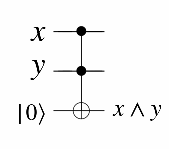
</figure>
</div>

<div style="flex: 2;">
<p>
<span style="background-color: #fed2cc;">\( |0\rangle|0\rangle\)</span>\(|0\rangle\)   \(\rightarrow  |0\rangle|0\rangle|0\rangle,\)<br/>
\(|0\rangle|0\rangle|1\rangle  \rightarrow  |0\rangle|0\rangle|1\rangle,\)<br/>
<span style="background-color: #fed2cc;"> \(|0\rangle|1\rangle\)</span>\(|0\rangle\) \(\rightarrow  |0\rangle|1\rangle|0\rangle,\)<br/>
\(|0\rangle|1\rangle\)\(|1\rangle  \rightarrow  |0\rangle|1\rangle|1\rangle,\)<br/>
<span style="background-color: #fed2cc;">\(|1\rangle|0\rangle\)</span>\(|0\rangle  \rightarrow  |1\rangle|0\rangle|0\rangle,\)<br/>
\(|1\rangle|0\rangle\)\(|1\rangle  \rightarrow  |1\rangle|0\rangle|1\rangle,\)<br/>
<span style="background-color: #fed2cc;">\(|1\rangle|1\rangle\)</span>\(|0\rangle  \rightarrow  |1\rangle|1\rangle|1\rangle,\)<br/>
\(|1\rangle|1\rangle\)\(|1\rangle  \rightarrow  |1\rangle|1\rangle|0\rangle.\)
</p>
</div>

</div>

</center>


**Observation 2**: The Toffoli gate can simulate NOT gate.

<center>
<div style="display: flex; flex-direction: row; align-items: flex-start; gap: 20px;">

<div style="flex: 1;">
<figure style="width: 100%;">
  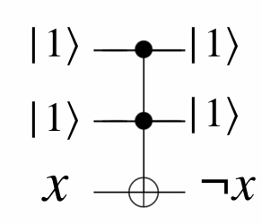
</figure>
</div>

<div style="flex: 2;">
<p>
\( |0\rangle|0\rangle\)\(|0\rangle\)   \(\rightarrow  |0\rangle|0\rangle|0\rangle,\)<br/>
\(|0\rangle|0\rangle|1\rangle  \rightarrow  |0\rangle|0\rangle|1\rangle,\)<br/>
\(|0\rangle|1\rangle\)\(|0\rangle\) \(\rightarrow  |0\rangle|1\rangle|0\rangle,\)<br/>
\(|0\rangle|1\rangle\)\(|1\rangle  \rightarrow  |0\rangle|1\rangle|1\rangle,\)<br/>
\(|1\rangle|0\rangle\)\(|0\rangle  \rightarrow  |1\rangle|0\rangle|0\rangle,\)<br/>
\(|1\rangle|0\rangle\)\(|1\rangle  \rightarrow  |1\rangle|0\rangle|1\rangle,\)<br/>
<span style="background-color: #fed2cc;">\(|1\rangle|1\rangle|0\rangle  \rightarrow  |1\rangle|1\rangle|1\rangle,\)</span><br/>
<span style="background-color: #fed2cc;">\(|1\rangle|1\rangle|1\rangle  \rightarrow  |1\rangle|1\rangle|0\rangle.\)</span>
</p>
</div>

</div>

</center>


## Exercises 

The CNOT gate helps to create entangled states.

```{exercise,label="ex-1"}
.

<center>
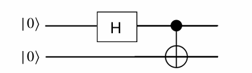
</center>
  

Show that the output state of the above circuit is the entangled state:


\[
\frac{1}{\sqrt{2}} \big(|00\rangle + |11\rangle\big).
\]

```


Note that the action on separable states is as follows:


\[
(A \otimes B)(|a\rangle \otimes |b\rangle) = (A|a\rangle) \otimes (B|b\rangle)
\]


> **Solution**\
> \[
> |0\rangle|0\rangle 
> \longrightarrow  |+\rangle |0\rangle=\frac{1}{\sqrt{2}}\big(|0\rangle > +|1\rangle\big)|0\rangle 
> \longrightarrow \frac{1}{\sqrt{2}}\big(|00\rangle +|10\rangle\big)
> \longrightarrow \frac{1}{\sqrt{2}}\big(|00\rangle +|11\rangle\big)
> \]


```{exercise,label="ex-X"}
Find the output

<center>
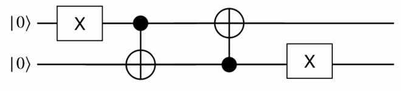
</center>
```

**Solution**:

<center>
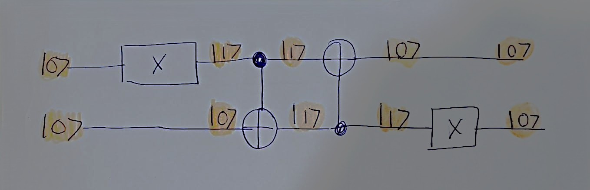
</center>

> \[
> |0\rangle| 0 \rangle
> \longrightarrow 
> |1\rangle| 0 \rangle
> \longrightarrow 
> |1\rangle| 1 \rangle
> \longrightarrow 
> |0\rangle| 1 \rangle
> \longrightarrow 
> |0\rangle| 0 \rangle
> \]


```{exercise,label="ex-H"}
Find the output
<center>
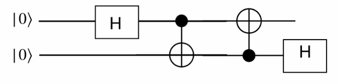
</center>
```

**Solution**\

> \[
> |0\rangle| 0 \rangle\\\\\\
> \downarrow \\\\\\
> |+\rangle |0\rangle = \left( \frac{1}{\sqrt{2}} |0\rangle + > \frac{1}{\sqrt{2}} |1\rangle \right) | 0\rangle
> = \frac{1}{\sqrt{2}} |00\rangle  + \frac{1}{\sqrt{2}} |10\rangle \\\\\\
> \downarrow\\\\\\
> \frac{1}{\sqrt{2}} |00\rangle  + \frac{1}{\sqrt{2}} |11\rangle\\\\\\
> \downarrow\\\\\\
> \frac{1}{\sqrt{2}} |00\rangle  + \frac{1}{\sqrt{2}} |01\rangle
> =|0\rangle  \otimes \underbrace{\left( \frac{1}{\sqrt{2}} |0\rangle + > \frac{1}{\sqrt{2}} |1\rangle \right)}_{|+\rangle}
> = |0\rangle  \otimes  |+\rangle\\\\\\
> \downarrow\\\\\\
>  |0\rangle | 0\rangle
> \]


<!--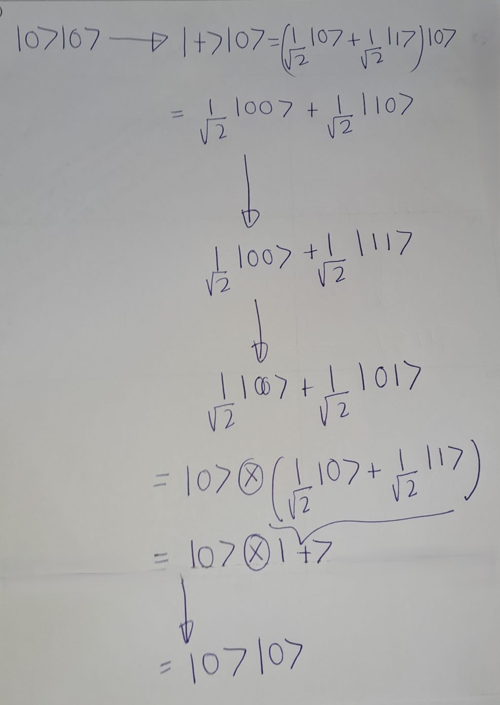-->

