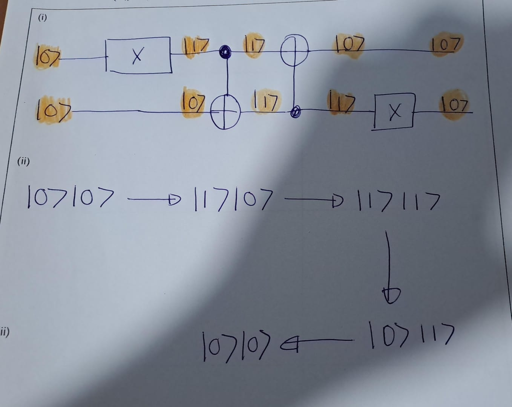

# Quantum Gates
Action of an arbitrary single qubit quantum gate:


**Notation**: 


**Outer Product Notation**:

Suppose a single-qubit quantum gate \( A \) transforms \( |0\rangle \) into \( |\psi_0\rangle \) and \( |1\rangle \) into \( |\psi_1\rangle \). Then the outer product representation of \( A \) is given by:


\[
A = |\psi_0\rangle\langle 0| + |\psi_1\rangle\langle 1|.
\]


## Hadamard gate

Hadamard gate is of particular importance, as it enables Hadamard transformation.


The Hadamard gate is represented as:


\[
H = \frac{1}{\sqrt{2}}
\begin{pmatrix}
1 & 1 \\
1 & -1
\end{pmatrix}
\]

The Hadamard gate transforms basis states as follows:


\[
\begin{eqnarray}
H|0\rangle &=& \frac{1}{\sqrt{2}}
\begin{pmatrix}
1 & 1 \\
1 & -1
\end{pmatrix}
\begin{pmatrix}
1 \\
0
\end{pmatrix}
= \frac{1}{\sqrt{2}}
\begin{pmatrix}
1 \\
1
\end{pmatrix}
= \frac{1}{\sqrt{2}} (|0\rangle + |1\rangle)(\#eq:eq1)\\
H|1\rangle &=& \frac{1}{\sqrt{2}}
\begin{pmatrix}
1 & 1 \\
1 & -1
\end{pmatrix}
\begin{pmatrix}
0 \\
1
\end{pmatrix}
= \frac{1}{\sqrt{2}}
\begin{pmatrix}
1 \\
-1
\end{pmatrix}
= \frac{1}{\sqrt{2}} (|0\rangle - |1\rangle)(\#eq:eq2)
\end{eqnarray}
\]


The computational basis \(\{|0\rangle, |1\rangle\}\) is mapped to the Hadamard basis \(\{|+\rangle,|-\rangle)


Hadamard gate is often used in quantum algorithms to make equal superposition of states.


```{exercise}
What is the outer product representation of the Hadamard gate?

```
**Solution**\


The outer product representation of the Hadamard gate can be expressible as:


\[
H|x\rangle=|+\rangle + \langle 0| + |-\rangle\langle 1|
\]

Further, By \@ref(eq:eq1) and \@ref(eq:eq2) we get,

\[
H|x\rangle=\frac{1}{\sqrt{2}} \big(|0\rangle + (-1)^x |1\rangle\big)
\]


In compact form, the action of Hadamard gate can be
expressed as
\[
H=\frac{1}{\sqrt{2}}\sum_{x,y\in\{0,1\}}(-1)^{xy} |x\rangle  \langle y|.
\]


## Pauli gates 

As in classical gates, there is a \textbf{NOT gate} in quantum computing.

The role of a quantum NOT gate is transforming \( |0\rangle \) into \( |1\rangle \) and \( |1\rangle \) to \( |0\rangle \).

It turns out that the Pauli x-matrix does this task. Therefore, the corresponding gate is called \textbf{Pauli x-gate} as well.


\[
X = \sigma_x = \begin{pmatrix} 0 & 1 \\ 1 & 0 \end{pmatrix}
\]


```{exercise}
What is the Outer-product representation of the Pauli $X$-gate?
```

**Solution**:\
\[
\sigma_x= |0\rangle\langle 1| + |1\rangle\langle 0|.
\]

The other Pauli matrices are also used as quantum gates, defining the Pauli Y-gate and Pauli Z-gate as follows:


\[
Y = \sigma_y = 
\begin{pmatrix}
0 & -i \\
i & 0
\end{pmatrix}
\]


\[
Z = \sigma_z = 
\begin{pmatrix}
1 & 0 \\
0 & -1
\end{pmatrix}
\] 


## Phase flip


Recall that the global phase is not physically significant, and we are interested in changing the local phase. It is possible to define a phase flip gate performing the following operations:


\[
\begin{aligned}
|0\rangle &\rightarrow |0\rangle \\
|1\rangle &\rightarrow e^{i\phi} |1\rangle
\end{aligned}
\]


That is:


\[
P(\phi) = \begin{pmatrix}
1 & 0 \\
0 & e^{i\phi}
\end{pmatrix}.
\]


Two commonly used phase flip gates are:


\[
S = P\left(\frac{\pi}{2}\right) = \begin{pmatrix}
1 & 0 \\
0 & e^{\frac{pi}{2}}
\end{pmatrix}=
\begin{pmatrix}
1 & 0 \\
0 & i
\end{pmatrix}
\]


\[
T = P\left(\frac{\pi}{4}\right) = \begin{pmatrix}
1 & 0 \\
0 & e^{i\frac{\pi}{4}}
\end{pmatrix}
\]


## CNOT gate

CNOT is a two-qubit gate. Controlled operations play a key role in multi-qubit gates. 

The CNOT gate is the most commonly used two-qubit controlled operation. The state of the first qubit controls whether the second qubit will be flipped or not. The first qubit is referred to as the \textbf{control qubit}, and the second qubit is called the \textbf{target qubit}.

The required transformation can be written in Dirac notation as follows:


\[
\begin{eqnarray}
|0\rangle|0\rangle & \rightarrow & |0\rangle|0\rangle, \\
|0\rangle|1\rangle & \rightarrow & |0\rangle|1\rangle, \\
|1\rangle|0\rangle & \rightarrow & |1\rangle|1\rangle, \\
|1\rangle|1\rangle & \rightarrow & |1\rangle|0\rangle.
\end{eqnarray}
\]

**Diagram**:\


The matrix representation of the CNOT gate is:


\[
\text{CNOT} =
\begin{pmatrix}
1 & 0 & 0 & 0 \\
0 & 1 & 0 & 0 \\
0 & 0 & 0 & 1 \\
0 & 0 & 1 & 0
\end{pmatrix}.
\]


The CNOT gate helps to create entangled states.

```{exercise}


Show that the output state of the above circuit is the entangled state:


\[
\frac{1}{\sqrt{2}} \big(|00\rangle + |11\rangle\big).
\]

```


Note that the action on separable states is as follows:


\[
(A \otimes B)(|a\rangle \otimes |b\rangle) = (A|a\rangle) \otimes (B|b\rangle
\]


**Solution**\

```{exercise}
Find the output

```

**Solution**\



```{exercise}
Find the output

```

**Solution**\


