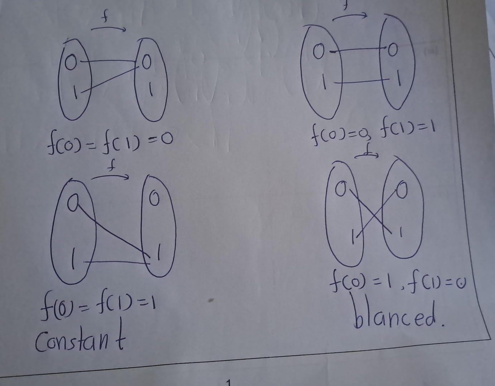
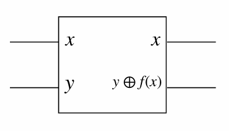
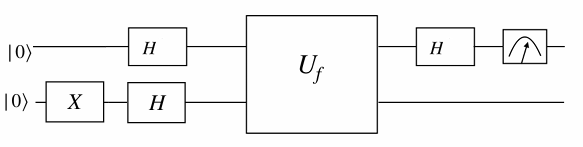
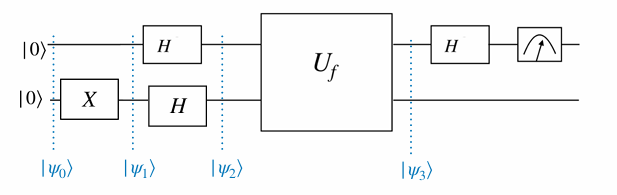
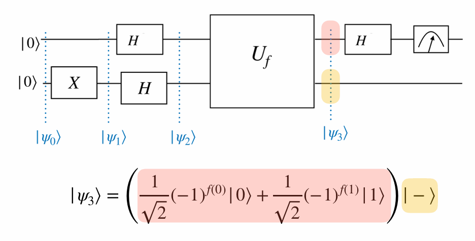
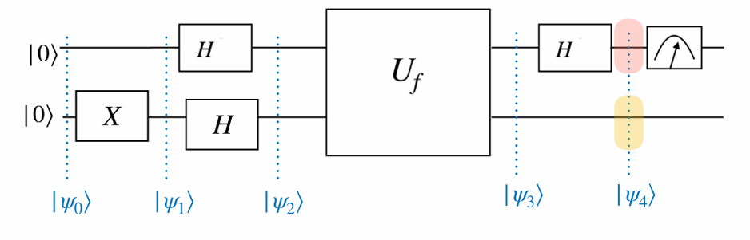

# Deutsch’s Algorithm

{width=30%}

An early stage quantum algorithm that demonstrates the computational power of quantum computers is the algorithm invented by David Deutsch in 1985.


Deutsch’s algorithm is based on quantum parallelism - in this context, the ability to evaluate a function $f(x)$ at different $x$  values simultaneously

Consider functions from a one-bit domain \(\{0, 1\}\) to the same one-bit co-domain. There are two types of functions: constant and balanced.

We are given a function:  
\[f : \{0,1\} \to \{0,1\}\]

Our goal is to determine whether **f** is:  
- **Constant**: \( f(0) = f(1) \) (same output for both inputs)?  
- **Balanced**: \( f(0) \neq f(1) \) (different outputs for each input)?



#### Classical Solution,
*Algorithm 1: Classical Algorithm for the Deutsch Problem (\( n = 1 \))**

**Require**: A black-box function \( f : \{0,1\} \rightarrow \{0,1\} \)  

1:  **Evaluate**: Compute \( f(0) \) and \( f(1) \).  
2:  **if** \( f(0) = f(1) \) **then**  
3: $~~~~~~$ Output: "Constant"  
4:  **else**  
5: $~~~~~~$ Output: "Balanced"  
6:  **end if**

**Explanation**

- Line 1: Input is a black-box function $f : \{0,1\} → \{0,1\}$.
- Line 2: Evaluate the function at both possible inputs $(0$ and $1)$.
- Line 3–6: Compare the outputs:
  - If $f (0) = f(1)$, then the function is constant.
  - If $f (0)= f(1),$ then the function is balanced.

Classically, two queries to the function are necessary to determine this. Deutsch’s algorithm provides a quantum protocol to do this with a single query to the function

```{exercise}
Let \(x, y \in \{0, 1\}\) and \(f : \{0, 1\} \to \{0, 1\}\). Show that the transformation:


\[
U_f |x, y\rangle = |x, y \oplus f(x)\rangle
\]


where \(\oplus\) denotes addition modulo 2, 
is unitary.

```

**Solution**\


The above transformation can be implemented in a quantum circuit by querying an oracle.


**Diagram**:\ 

 This quantum circuit queries an oracle, and implements $U_f$
 
Note that the transformation can be written as:

\[
U_f \big(|+\rangle , |0\rangle\big) = \frac{1}{\sqrt{2}} \big(|0, f(0)\rangle + |1, f(1)\rangle\big).
\]

This contains information about both \( f(0) \) and \( f(1) \). That is like evaluating the function \( f \) at two different points in the domain. This is called Quantum parallelism.

\[
\begin{eqnarray}
U_f |x, -\rangle 
&=& U_f \left( |x\rangle \otimes \left( \frac{1}{\sqrt{2}} |0\rangle - \frac{1}{\sqrt{2}} |1\rangle \right) \right)\\
&=& \frac{1}{\sqrt{2}} U_f (|x\rangle \otimes |0\rangle) - \frac{1}{\sqrt{2}} U_f (|x\rangle \otimes |1\rangle)\\
&=& \frac{1}{\sqrt{2}} |x, f(x)\rangle - \frac{1}{\sqrt{2}} |x, 1 \oplus f(x)\rangle.
\end{eqnarray}
\]


- When \( f(x) = 0 \):


\[
U_f |x, -\rangle = \frac{1}{\sqrt{2}} |x, 0\rangle - \frac{1}{\sqrt{2}} |x, 1\rangle.
\]


- When \( f(x) = 1 \):


\[
U_f |x, -\rangle = -\frac{1}{\sqrt{2}} |x, 0\rangle + \frac{1}{\sqrt{2}} |x, 1\rangle.
\]

Then we can summarize,

\[
U_f |x, -\rangle = (-1)^{f(x)} |x, -\rangle.
\]
This is called **Phase kickback**.


Deutsch’s algorithm is a black box algorithm, that uses quantum parallelism, and can be implemented efficiently using a quantum computer.



Given a function \(f :\{0,1\} \rightarrow \{0,1\}\),  Deutsch’s algorithm determines whether $f$ is constant or balanced, with a single query to the function


 


\[\begin{eqnarray}
 |\psi_0\rangle &=& |00\rangle\\
 |\psi_1\rangle &=& |0\rangle X|0\rangle = |01\rangle\\
 |\psi_2\rangle &=& H|0\rangle H|1\rangle = |+\rangle|−\rangle\\
 |\psi_3\rangle &=& U_f| +,−\rangle\\
 &=& U_f \left( \frac{1}{\sqrt{2}} |0, -\rangle + \frac{1}{\sqrt{2}} |1, -\rangle \right)\\
 &=& \frac{1}{\sqrt{2}} U_f |0, -\rangle + \frac{1}{\sqrt{2}} U_f |1, -\rangle
 &=& 
\end{eqnarray}
\]

Then, \[\text{Phase kickback }
U_f |x, -\rangle = (-1)^{f(x)} |x, -\rangle \quad \text{for } x \in \{0, 1\}.
\]


Then,


\[
U_f | +, - \rangle = \frac{1}{\sqrt{2}} (-1)^{f(0)} | 0, - \rangle + \frac{1}{\sqrt{2}} (-1)^{f(1)} | 1, - \rangle
\]


\[
= \left( \frac{1}{\sqrt{2}} (-1)^{f(0)} | 0 \rangle + \frac{1}{\sqrt{2}} (-1)^{f(1)} | 1 \rangle \right) | - \rangle
\]





| If $f$ is constant  | If $f$ is balanced |
|:--------------------|:-------------------|
|\(f(0) = f(1) = 0     \quad \rightarrow \quad\)<span style="background-color: #fed2cc;"> \( | + \rangle\)</span><span style="background-color: #fce9b0;"> \( | - \rangle\)</span>|\(f(0) = 0, f(1) = 1  \quad \rightarrow \quad\)<span style="background-color: #fed2cc;">\(   | - \rangle\)</span><span style="background-color: #fce9b0;">\( | - \rangle\)</span>| \\
|\(f(0) = f(1) = 1     \quad \rightarrow \quad\)<span style="background-color: #fed2cc;"> \( - | + \rangle\)</span><span style="background-color: #fce9b0;">\( | - \rangle\) </span>|\(f(0) = 1, f(1) = 0  \quad \rightarrow \quad\)<span style="background-color: #fed2cc;">\( - | - \rangle \)</span><span style="background-color: #fce9b0;">\(| - \rangle\)</span>| 

\(|\psi_4\rangle\) becomes one of the following states, depending on \(f\). 



| If $f$ is constant  | If $f$ is balanced |
|:--------------------|:-------------------|
|\(f(0) = f(1) = 0     \quad \rightarrow \quad\)<span style="background-color: #fed2cc;"> \( | 0 \rangle\)</span><span style="background-color: #fce9b0;"> \( | - \rangle\)</span>|\(f(0) = 0, f(1) = 1  \quad \rightarrow \quad\)<span style="background-color: #fed2cc;">\(   | 1 \rangle\)</span><span style="background-color: #fce9b0;">\( | - \rangle\)</span>| \\
|\(f(0) = f(1) = 1     \quad \rightarrow \quad\)<span style="background-color: #fed2cc;"> \( - | 0 \rangle\)</span><span style="background-color: #fce9b0;">\( | - \rangle\) </span>|\(f(0) = 1, f(1) = 0  \quad \rightarrow \quad\)<span style="background-color: #fed2cc;">\( - | 1 \rangle \)</span><span style="background-color: #fce9b0;">\(| - \rangle\)</span>|  

Therefore, the measurement outcome of the first qubit is \(0\) if the function \(f\) is constant, and \(1\) if it is balanced. Later on, Deutsch generalized his algorithm with Richard Jozsa to apply to constant or balanced functions of any input size. 

**Problem**:
Given an unknown function \(f : \{0, 1, \dots, 2^n-1\} \to \{0, 1\}\), which is either constant or balanced, determine whether \(f\) is constant or balanced. 

Classically, this requires \(2^{n-1} + 1\) queries to the function in the worst case. The Deutsch-Jozsa algorithm accomplishes this with a single query.


