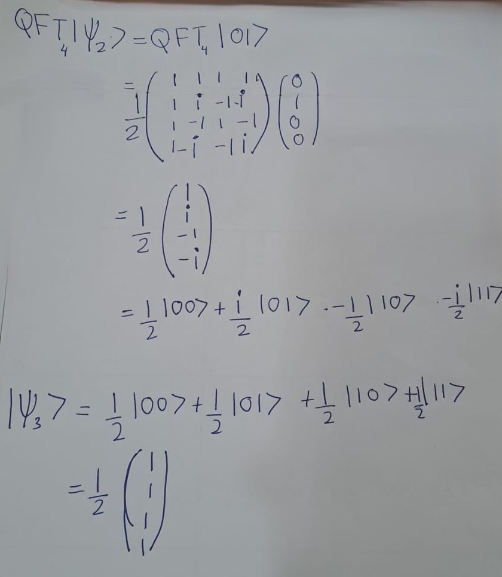

# Quantum Fourier Trasnform (QFT)

Quantum Fourier transformation (QFT) is one of the major quantum algorithms, and plays a key role in several quantum algorithms. 

It is the quantum counterpart of the classical discrete Fourier transformation (DFT). 

DFT transforms a vector of complex numbers \( x_0, x_1, \ldots, x_{N-1} \) 

into \( y_0, y_1, \ldots, y_{N-1} \) such that:


\[
y_k \equiv \frac{1}{\sqrt{N}} \sum_{j=0}^{N-1} x_j e^{2\pi ijk/N}
\]


```{example}
Suppose you have a data set \(x_j=\sqrt{2},2\). Compute the DFT of this set.
```
**Solution:**\

Thus, and Here \(x_0 = \sqrt{2}\) and \(N = 2\).

\[
y_k = \frac{1}{\sqrt{2}} \sum_{j=0}^{1} x_j e^{\frac{2 \pi i j k}{2}} = \frac{1}{\sqrt{2}} \left( \sqrt{2} + 2 e^{i \pi k} \right)
\]


Thus,
\[
y_0 = \frac{1}{\sqrt{2}} \left( \sqrt{2} + 2 \right) = 1 + \sqrt{2},
\]
and
\[
y_1 = \frac{1}{\sqrt{2}} \left( \sqrt{2} + 2 e^{i \pi} \right) = \frac{1}{\sqrt{2}} \left( \sqrt{2} - 2 \right) = 1 - \sqrt{2}.
\]

Resource: _Pathak, A., 2013. Elements of quantum computation and quantum communication (pp. 92-98). Boca Raton: CRC Press_

```{example}
Find \( y_0 \) for \( x_j = \{1 + i, \sqrt{2}, 3 - 2i, 4\} \).
```

**Solution** :\
Here \( N = 4 \) and
\[
y_0 = \frac{1}{\sqrt{N}} \sum_{j=0}^{N-1} x_j = \frac{1}{2} \left( (1 + i) + (\sqrt{2}) + (3 - 2i) + 4 \right) = 4 + \frac{\sqrt{2} - i}{2}.
\]

Resource: _Pathak, A., 2013. Elements of quantum computation and quantum communication (pp. 92-98). Boca Raton: CRC Press_


\[
\text{Primitive } n \text{ th root of unity }:\omega=e^{\frac{2\pi i}{n}}
\]

\textbf{Matrix Form of Discrete Fourier Transform (DFT):}


\[
\frac{1}{\sqrt{N}}
\begin{bmatrix}
1 & 1 & 1 & \cdots & 1 \\
1 & \omega^1 & \omega^2 & \cdots & \omega^{(N-1)} \\
1 & \omega^2 & \omega^4 & \cdots & \omega^{2(N-1)} \\
1 & \omega^3 & \omega^6 & \cdots & \omega^{3(N-1)} \\
\vdots & \vdots & \vdots & \ddots & \vdots \\
1 & \omega^{(N-1)} & \omega^{2(N-2)} & \cdots & \omega^{(N-1)(N-1)}
\end{bmatrix}
\]
where \( \omega \) is the primitive \( n \)-th root of unity.


**Runtime Analysis for Fourier Transforms**:

- **Naive Runtime**: \( O(N^2) \)
  -  naive computation of the Discrete Fourier Transform (DFT) involves a double summation loop over \( N \) elements, resulting in a runtime complexity of \( O(N^2) \).
- **Fast Fourier Transform (FFT) Runtime**: \( O(N \log N) \)
  - In practical applications, the DFT is computed using the FFT algorithm, which optimizes the process by reducing redundant calculations. This leads to a significant improvement in runtime complexity to \( O(N \log N) \).
- **Quantum Fourier Transform (QFT) Runtime**: \( O(\mathrm{polylog} N) \)
  - The QFT, implemented on quantum computers, provides an exponential speedup over classical algorithms with a runtime complexity of \( O(\mathrm{polylog} N) \). This represents an exponential gain compared to both naive and FFT approaches.


Quantum version of DFT:

\[\text{QFT_N}
\frac{1}{\sqrt{N}}
\begin{bmatrix}
1 & 1 & 1 & \cdots & 1 \\
1 & \omega^1 & \omega^2 & \cdots & \omega^{(N-1)} \\
1 & \omega^2 & \omega^4 & \cdots & \omega^{2(N-1)} \\
1 & \omega^3 & \omega^6 & \cdots & \omega^{3(N-1)} \\
\vdots & \vdots & \vdots & \ddots & \vdots \\
1 & \omega^{(N-1)} & \omega^{2(N-2)} & \cdots & \omega^{(N-1)(N-1)}
\end{bmatrix}
\]
where \( \omega \) is the primitive \( n \)-th root of unity.

**Recall**: 
Suppose a single qubit quantum gate **$A$** transforms \(|0\rangle\) into \(|\psi_0\rangle \) and \(|1\rangle \) into \(|\psi_1\rangle \). Then the outer product representation of $A$ is given by,
\[
A=|\psi_0\rangle \langle 0|+|\psi_1\rangle \langle 1|
\]


Quantum Fourier Transform (QFT) in Dirac notation:

\[
QFT_N = \frac{1}{\sqrt{N}} \sum_{x=0}^{N-1} \sum_{y=0}^{N-1} \omega_N^{xy} |y\rangle \langle x|
\]


```{example}
Examples
Lets take a look at \(QFT_2\). Because \(M =2,\omega=e^{i\pi}\).
Therefore we have,
\[
QFT_2=\frac{1}{\sqrt{2}} \begin{pmatrix}
1 & 1\\
1 & \omega
\end{pmatrix}=\frac{1}{\sqrt{2}} \begin{pmatrix}
1 & 1\\
1 & -1
\end{pmatrix}\\\\
\]


As you can see, \(QFT_2\) is simply equal to \(H^\otimes 2\)
How about \(QFT_4\)? The primitive 4th root of unity is \(i\), so that

\[
QFT_4 = 
\frac{1}{\sqrt{4}} \begin{pmatrix}
1 & 1 & 1 & 1\\
1 & i & -1 & -i\\
1 & -1 & 1 & -1\\
1 & -i & -1 & -i\\
\end{pmatrix}
\]
```


```{exercise}
Find QFT of following vectors.
\[
\begin{eqnarray}
| \psi_1 \rangle &=& | 00 \rangle\\
| \psi_2 \rangle &=& | 01 \rangle \\
| \psi_3 \rangle &=& \frac{1}{2} \left( | 00 \rangle + | 01 \rangle + | 10 \rangle + | 11 \rangle \right)
\end{eqnarray}
\]
```




