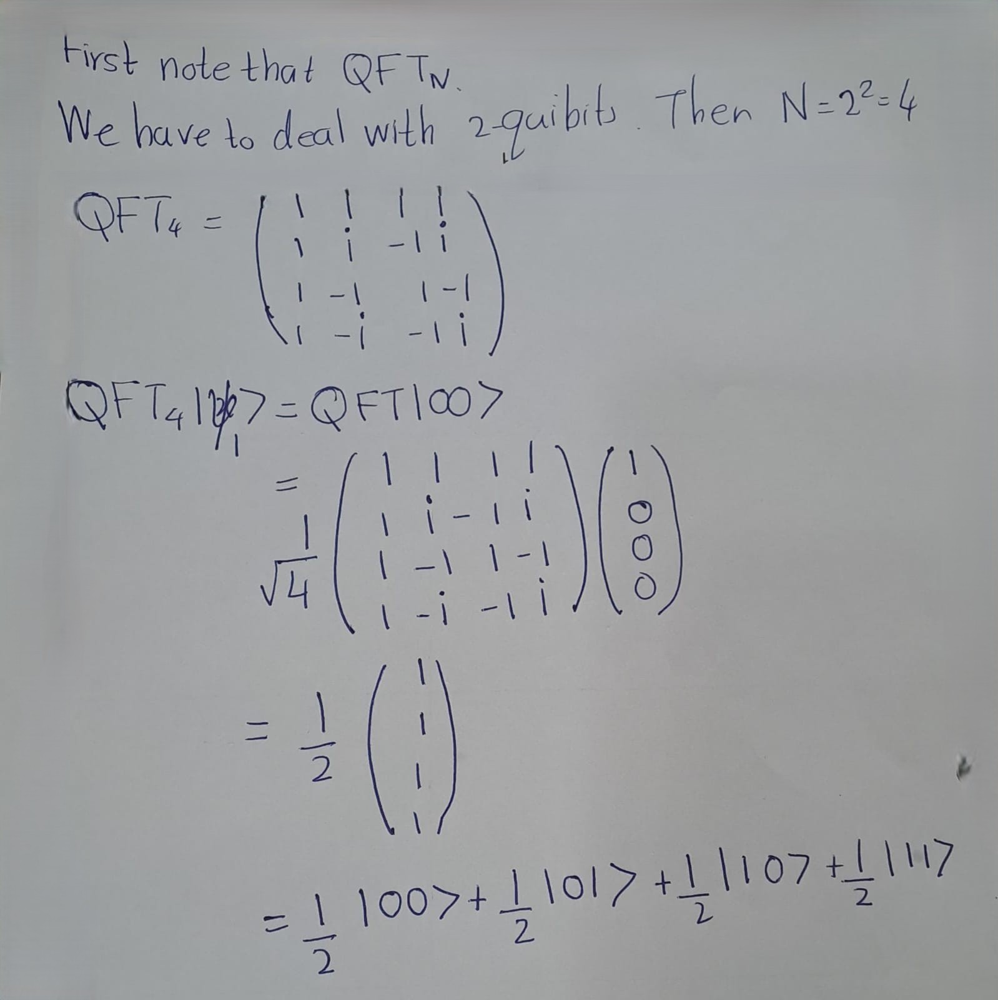

# Quantum Fourier Trasnform (QFT)

Quantum Fourier transformation (QFT) is one of the major quantum algorithms, and plays a key role in several quantum algorithms. 

It is the quantum counterpart of the classical discrete Fourier transformation (DFT). 

DFT transforms a vector of complex numbers \( x_0, x_1, \ldots, x_{N-1} \) 

into \( y_0, y_1, \ldots, y_{N-1} \) such that:


\[
y_k \equiv \frac{1}{\sqrt{N}} \sum_{j=0}^{N-1} x_j e^{2\pi ijk/N}
\]


```{example}
Suppose you have a data set \(x_j=\sqrt{2},2\). Compute the DFT of this set.
```
**Solution:**\

Thus, and Here \(x_0 = \sqrt{2}\) and \(N = 2\).

\[
y_k = \frac{1}{\sqrt{2}} \sum_{j=0}^{1} x_j e^{\frac{2 \pi i j k}{2}} = \frac{1}{\sqrt{2}} \left( \sqrt{2} + 2 e^{i \pi k} \right)
\]


Thus,
\[
y_0 = \frac{1}{\sqrt{2}} \left( \sqrt{2} + 2 \right) = 1 + \sqrt{2},
\]
and
\[
y_1 = \frac{1}{\sqrt{2}} \left( \sqrt{2} + 2 e^{i \pi} \right) = \frac{1}{\sqrt{2}} \left( \sqrt{2} - 2 \right) = 1 - \sqrt{2}.
\]

Resource: _Pathak, A., 2013. Elements of quantum computation and quantum communication (pp. 92-98). Boca Raton: CRC Press_

```{example}
Find \( y_0 \) for \( x_j = \{1 + i, \sqrt{2}, 3 - 2i, 4\} \).
```

**Solution** :\
Here \( N = 4 \) and
\[
y_0 = \frac{1}{\sqrt{N}} \sum_{j=0}^{N-1} x_j = \frac{1}{2} \left( (1 + i) + (\sqrt{2}) + (3 - 2i) + 4 \right) = 4 + \frac{\sqrt{2} - i}{2}.
\]

Resource: _Pathak, A., 2013. Elements of quantum computation and quantum communication (pp. 92-98). Boca Raton: CRC Press_


\[
\text{Primitive } n \text{ th root of unity }:\omega=e^{\frac{2\pi i}{n}}
\]

\textbf{Matrix Form of Discrete Fourier Transform (DFT):}


\[
\frac{1}{\sqrt{N}}
\begin{bmatrix}
1 & 1 & 1 & \cdots & 1 \\
1 & \omega^1 & \omega^2 & \cdots & \omega^{(N-1)} \\
1 & \omega^2 & \omega^4 & \cdots & \omega^{2(N-1)} \\
1 & \omega^3 & \omega^6 & \cdots & \omega^{3(N-1)} \\
\vdots & \vdots & \vdots & \ddots & \vdots \\
1 & \omega^{(N-1)} & \omega^{2(N-2)} & \cdots & \omega^{(N-1)(N-1)}
\end{bmatrix}
\]
where \( \omega \) is the primitive \( n \)-th root of unity.


**Runtime Analysis for Fourier Transforms**:

- **Naive Runtime**: \( O(N^2) \)
  -  naive computation of the Discrete Fourier Transform (DFT) involves a double summation loop over \( N \) elements, resulting in a runtime complexity of \( O(N^2) \).
- **Fast Fourier Transform (FFT) Runtime**: \( O(N \log N) \)
  - In practical applications, the DFT is computed using the FFT algorithm, which optimizes the process by reducing redundant calculations. This leads to a significant improvement in runtime complexity to \( O(N \log N) \).
- **Quantum Fourier Transform (QFT) Runtime**: \( O(\mathrm{polylog} N) \)
  - The QFT, implemented on quantum computers, provides an exponential speedup over classical algorithms with a runtime complexity of \( O(\mathrm{polylog} N) \). This represents an exponential gain compared to both naive and FFT approaches.


Quantum version of DFT:

\[\text{QFT_N}
\frac{1}{\sqrt{N}}
\begin{bmatrix}
1 & 1 & 1 & \cdots & 1 \\
1 & \omega^1 & \omega^2 & \cdots & \omega^{(N-1)} \\
1 & \omega^2 & \omega^4 & \cdots & \omega^{2(N-1)} \\
1 & \omega^3 & \omega^6 & \cdots & \omega^{3(N-1)} \\
\vdots & \vdots & \vdots & \ddots & \vdots \\
1 & \omega^{(N-1)} & \omega^{2(N-2)} & \cdots & \omega^{(N-1)(N-1)}
\end{bmatrix}
\]
where \( \omega \) is the primitive \( n \)-th root of unity.

**Recall**: 
Suppose a single qubit quantum gate **$A$** transforms \(|0\rangle\) into \(|\psi_0\rangle \) and \(|1\rangle \) into \(|\psi_1\rangle \). Then the outer product representation of $A$ is given by,
\[
A=|\psi_0\rangle \langle 0|+|\psi_1\rangle \langle 1|
\]


Quantum Fourier Transform (QFT) in Dirac notation:

\[
QFT_N = \frac{1}{\sqrt{N}} \sum_{x=0}^{N-1} \sum_{y=0}^{N-1} \omega_N^{xy} |y\rangle \langle x|
\]


```{example}
Examples
Lets take a look at \(QFT_2\). Because \(M =2,\omega=e^{i\pi}\).
Therefore we have,
\[
QFT_2=\frac{1}{\sqrt{2}} \begin{pmatrix}
1 & 1\\
1 & \omega
\end{pmatrix}=\frac{1}{\sqrt{2}} \begin{pmatrix}
1 & 1\\
1 & -1
\end{pmatrix}\\\\
\]


As you can see, \(QFT_2\) is simply equal to \(H^\otimes 2\)
How about \(QFT_4\)? The primitive 4th root of unity is \(i\), so that

\[
QFT_4 = 
\frac{1}{\sqrt{4}} \begin{pmatrix}
1 & 1 & 1 & 1\\
1 & i & -1 & -i\\
1 & -1 & 1 & -1\\
1 & -i & -1 & -i\\
\end{pmatrix}
\]
```


```{exercise}
Find QFT of following vectors.
\[
\begin{eqnarray}
| \psi_1 \rangle &=& | 00 \rangle\\
| \psi_2 \rangle &=& | 01 \rangle \\
| \psi_3 \rangle &=& \frac{1}{2} \left( | 00 \rangle + | 01 \rangle + | 10 \rangle + | 11 \rangle \right)
\end{eqnarray}
\]
```




QFT needs to be restated in a particular form to implement it on a quantum circuit. This requires some results.


Quantum Fourier Transform (QFT) in Dirac notation:
   $$
   QFT_N = \frac{1}{\sqrt{N}} \sum_{x=0}^{N-1} \sum_{y=0}^{N-1} \omega_N^{xy} |y\rangle \langle x|
   $$

QFT on \(|x\rangle\) as a superposition:
   $$
   QFT|x\rangle = \frac{1}{\sqrt{N}} \sum_{y=0}^{N-1} \omega_N^{xy} |y\rangle
   $$

Binary representation of \(y\):
   $$
   y = y_n + 2y_{n-1} + \cdots + 2^{n-1}y_1
   $$

QFT on \(|x\rangle\) as a product:
   $$
   QFT|x\rangle = \frac{1}{\sqrt{2^n}} \sum_{y_k \in \{0,1\}} \bigotimes_{k=1}^n e^{\frac{2\pi i}{2^n} 2^{n-k} xy_k} |y_k\rangle
   $$


## I  will update this part ASAP.

![](data:image/png;base64,iVBORw0KGgoAAAANSUhEUgAAAPAAAADSCAMAAABD772dAAAA8FBMVEX/////AADu7u7t7e0BAQH09PT6+vr19fX7+/vx8fH6eHj8Xl7++Pj59/f7///4///+FRXy6+v48fH1///+CwtmZmZQUFD+HR3d3d39gIC0tLSOjo7+TEz+LCz+JCT9yMj4p6f80tL95+f8cnL9Z2f9VFT7sbF5eXn0yMj9mZn/Q0P94uL9RUX4g4P5kJD56+v+urry3Nybm5vNzc1bW1v+oaH5bGwzMzP+2toeHh78WVnrzMymnZ08Pj7Rv7/6YWH8NTXyvLxkJiavlZXAoKBxXl51cXHe0NDhu7vPs7NaT0+RiYkTExOSfn44LS2YmJjtgglvAAARNUlEQVR4nO2dDXubOBLHMQoItTY4OE3SNolj56VpnMRJX91uu2nudru3d7vX7/9tzjYgBOg/vBjHNr15dp9utRrQzxJopJkRhiHFMiOx4kIWlTFbljlxYVyRy0IRF5oLaQtZkesa5MgyWxaaudrxf/8feHnAFhcdh3ORo90UYMsbn18/eXJ9PnZ/CmDDP9lrzWXvpP0zAA+uWlIuB80HHh+2FDkaNB24/bmVkKfthgPftlLyeoXALBIVWIoKLEUFjkQFTmu307ytVhtqC1moNllzb1uWmbnahiXFjkVXyGUZ11XUFqa13Zss8I1bVDtVWPLeYaH2RWrrxqwVFSa7sMSIZ1Y/y9tq9S2mH7NJ7aAs0YVlR/xcuziwrFnVdmTuvQ74yi0OXOAhzXvEHxHYO9fxtlrnXkOBtw/0wN+GoonAzD3W887eW00EtsaIt9VSlhHNAebXGPhDXLExwJ52Soqkv47Ai83DbfDGCuRALhSXPg8/kqVlwDdWIMduaUsrp0HI0lK7cHm2tLC/0cCHQ/FItrQCLEd37asl8o0VyHV4gUYsDxkfdvOAu8PgCo0ANj3yjRXIgdecHtavktLS91hTgMcFOnjaxWPRDGDm5UxJkRy7rBHAVq8Y79Sk5o0Adp8UBX7uNWETT4wO81ED2RmI5RsehYni30OoF8jXvsonjeQKEMW/Zj5RJOoAUC8pB8OyVkuD4ryt1vk6rZaqAXdKdPC0i31304ELTkmRHG868LAcb6s1FJp7bxDwSVngE2+jgQsZ0Um55RsM3PlQHvhze2OBGbFx9/o1/F/HHlsm8BIND+FDqKPRGO/5+NYyDQ+51eUom2KOLKT3+IRO24q03feQ6cbzNJ7TUN576XvHDbJF9t625t5QO/5tlH3YhRYP8QAYQKRvPSF6uIsHUReSYzYuS+7DGqS2CixHek2rJfzGepiOUY4f8NARsWnLwwkEOvVn9fxTWOF2E4HT8Tqx7EzmUy2f7KAaQWzPhgFn4nWkRMaUh3cGzjcPuANhjvzQlrLaR7BSZ+OAsWHxPqrKiHnr+aYBD+DzGezGBtruGarVHTzGnlZUI7GnVRY4mIfx49n3WKyN3+Rny5qHC7sfC/skpxXdCwhy76raLnayXbgV7p3vTV2KLS1s6GrYGyge2uloGEAv2+VQHT712dJy9Ne4WuLYTr7pJbRZD28B3egC5tdyeci39yCFLZLaAk9f3TgMYs2BvacQYrrWTWoz9wFWfrohwNSU5Ge1ffjz7EQJAmsO7MPJtdW3s9o2XjWd+RsBjI3oJz2m8ab28Jx9uxHA0HfWnQit9gROTUfeKoGzK3ytNjYljtMxDaEq4TC/dmsH1pkOyZlaAmsMj0xSg4Gdozumqdc2O7CLu5MQuB7DQ7WkF/CHKm2i4nUGmUtK5QFUOvBMRBSXrS4wjdl4NXDfxtoOfm89TJ+DNV4ebuN9nQGlfQGn7qvpanJtgRnKamgFK3qsTcSBvLbXF5hwNez4pLY9hl3c8sXaAnvElJSjbRNTk2euKbDVx0+in9DOvuNNCz/9fWs9gZmjzcOay4OhaDNhO1OxEynxfACV7531BPZwkz+7irbt8Lsfb978uOOqtunCLm6da5NeVh2YZvrQxtqbqE/h23dbobx7GwMzcwS9a4fxA1FjdmkwzpxgsMlCWebwqFDwuDDW5i41JYXaQtjt71uKfG/P7zW/pPEcXuDYDW8uLOXemgap3tRsy62pdm1ZLc4INrfbiwwx0/7jH1tJeTufwINOwGHzo3DTdbGsllqXhx7un3MjMsS48ynFu/Wpbckm4zFyKjezFWD9Q/pIwBY2op/6Etj4nubd2nrmyCY7OMjpIYpmWhdgwtk7N6LnA9d+m+WdDmpbvlfu4EUOxmsFzLwHPBoNCWzs6oB3jfhFin+2h3BQrwewcKCNdTSWwMLQ8W5tGbGxPIYO1B1XrBGwhf2ewbEVAfCdHviFHTcZe1lvgi5eC2COt+EuXQnMnDcA2Imb7F6iK+0FgRKPCIzmYcawm1fdaGXGKz3wK0NpMvY7nrlpU6oscCq7tIw/NFHRxVvpn9uKtvFMD/zMUC7Zxn6avpu49+qyS/WnVcxkp89VbQisbEsSjoh716jBllaA5eguuVoiIjV6TNUGQ/pZMmCCiA7JG7OPtDzEJrAvEtrFgPHhCN21AHaxPXgrExgCbfCW/pEKiSEivNYBGLsaDtoiqQ2AX6aA8XEBe5M1ACb20NNzHgB+kw56wivNz8pvuCJgMia2IjARh9uPn5IVAUPLaBZalgJ+0AN/yYa1YcvNk+/B+gLTygDjOeS1mwZ2R3rgfjZwkbDNo4XxsiLxSGBziMPaZzVTPQyAR5p4enjZ7rAosN7yXDAwjYzXSXtT+RgA84w/lPCR38dEWlMqkqUEplGv06T2bPHAbT2wz7PmPw4vl+f2rGJ5iDco+jwDPP2rHtixsk0mMiLuOysDfoCNOvVS2hSwoTsTzyN2e1YGjAPah2nt0sDmEDtQVwVMbMd09MDvdLwf9cBe3rbRowNjX9C3cJWUAdbuWr7TA5sC5pZ3BysBJlwN+nTJAtu0apPzMrkeGxhPSWcdkdEOgP9ZqocdPDWNqgNXNTzahBEtstrzPRzjNx3wbwYKxJrAt+Jlu7LhofpDI1H8obIs4U0VwqVW6YpHM3FJ44UO+IWh3lv1h3rU3kLCH6rT1uPEv00ZW5oJ6pDKWDv9vOh9S4Y2N3XahZaHd4/GoqItrQBLrXxgIvv3RrlkeeDEWTyMExkRvcdcDxMngp2NFe0FgU0xJoLN44rLB+7gfZ0Lj4gu3v+Y5f1rHwMzDzsiTh6vh6k8rAOXlQT+SACbpoujcy8eDdjh0Mbam65t6wRmfARTgg5lMNOygYnzdZ5bZMC8/3vZHmY2fj2+fixg/KPvDWngsQb49zYFPLUwofVxFCXrLRSYNouDTDvTzKQhhn/z+b5OMsbfTJhxmqCWCDi8U+bEtAK7PbZsZdqZZmYMsfLZpS6OPDlrc4v0aOq8S68MdO+gkLfx1HTn4pbXll1K+JL6WDvwh+qAvxvIGo5KCPfzONuFebZ0+jELashCBTh8IHD02Ifo59JoBw+po+thByU1yCIchn2uxPGltGtaHlo9nDk6rAiMmiyL8Ep0r2ctGZiIMDx2c4FtzXLphZ0LTMQkzo7CXCYwcUjlYTRJLAHYx5HFo7JJL6WAmYNdDedRxSUAE6HJT8smvZQBpuL0T2VFApj/kQX+VwFg7hKhnODDJ3UACxyQtROv1ijgYRZ4xAsAE/kjB77+wyd1BKYRuTbKCQVEph73s8A+z52WDG4SOw7H9tJ6eBtu3LW24+vrgcMbZoENOLGoP5fQfIsrlO64StKLUSS7lPB+F/yEmA44IIrE1GnPiIhdQ9fUaNcQmIaP8j8YF/1IHATWaCfXOx24Sz1fo2W6sIblIXG+Ts5XAGLgTPThp6LAhEn9tC1vVCMwsa9zhppcAPhZYWADr5ouiueAFAY2bfjG2pkUB874D0sA4yPlduzae5gR3ssb2OQscMa79K44MLHz8D7q4tqAxQSukrrj4sDOn2ng30oA20Syn6gXmFr2H+MmZ3s4sxX/awlgcmpitQJz7Es6ID63WgD4bRlg6tQbXh5YztSZiHizk+vyKGh47P+VAt7H2hrTAcckfu7oNvE0hgfyh4YSFBBZDfde2ieZ0VY8mhb7muT9uG9BbY0/1MM52X0XuXdjb6ooml3qwtu0RsFoLHpGoEjNS//ezo46rM34NnagtpPaCy0eqMNyWFqbAmbGyyTwf9plgKcvTzojoiZgvK9zFR3aX7SHeWrP441dCpgK/JjH9tQDjDfuohTI4sAs8db6646XAzaJ8L/ruoCJ0zZdjTYJzIyEA/Fj0MIywIRJ/Us9wNhF253ED1dh4MSYflEBGE9NB24twNRhBjrtnKNr23/HvLsiDNkrA0w8Ye/rAMYpvS23CrDFZDzeLgutu3LAeJI8GktzsfqJaWSMZ9aUKvD9KevFx09T+fhCyKo5J4SldoDwmDvxZE10YhqPJfY0SrEI5+jVWK2pOirJMh5neHKrirZt46MwWwO34L0NYEsL/MDcesW/XaoGTMzvMJVcbRhbyPGq6bmbo60Cy5GuAONLf56d3aY2OdIu98EtQhtGjzIPh53e5mjnAeMPvE2s/CYvCZg6NeRwIWDCiXU9PxdrRcDUKQs3tDYNPMYbd/O94JUBC3yi87fhAsBUvE6RJiPgYI5YALhAbE8VYBxqcNAu1Ed6YGbazuwgsQWATZPwVI8qAxMfU+GVgQ1hiP1fvnz5ZV/kaJPA/AE27rQosFwIhMCEQWNr01aKAW+/Cc+Y+vSGkdp0UkPFD5+owKkedrBz9E6TxSG1dcBmDPzjv8rq8AelLZusPeZR4C8MzjIikDYOTOvh6Kg46B1qA2tYiFTg0q6wytvSYQcRc2avQmDaHYycuYyzGnTaxLxjZTOXdos5xOWNFGA8aXYHVtnlIaPysOKblgQWL9O8W1sv8wPTwIHaxEm4H5ySwNS5yVfKKZOlgJm9n+VNnJhWDlh4+EOwE16yhwXeORoorSsHbHzVAX81KvYwE9iBemiXAyZGy5MOkbZCAluaGJ6ZtDUZ4kWAp+9f4rmLx2EBYIGD3ltjq6KxzJwveuAvTlVgC/v49kZlgIlzk2/ItBUSGB8vVRWYudjavy4B7N5RJ5hXBTYxsP4A6XxgU4xxmo+cPPM38Sgj2qv8kQBTnyA+i3owqxge8z0cC4fanEavrdzsUioPy8jxhyYzPOOK89N2YQ+Xyg9N+kOpTC63UHYpE3jfNwjnKPrt0syIh4cAguxSWUjFFo6xA9WdXyFv8cB6hI1q5APj1ZKjCR6eSfa0pRBYapPBlERGRK8IMBGvE+6eVAXWBR7OBGkXBHagvbU3sfKBqdTg0IiuDvxDx/v3gsDEuv1m5q6ngZlNuBqIj48UA05HeMzkK1sUGB8p17qw08HYmR628Re9oqD36sDGr1ngX6F24WMccLj8vZvXw9YtVJZZDQsAG5lIvFdYuzAwcaTcOWc0MD7KvzWpA7id6uM/Ce3iB3Vsw0YfdixiE49M5Yz3dXL9oTGwxhDbVzY9dvcp7ZyDOpR7UyZ1MuklkV3KuT2EU9LlEDkvSxYaxtuXu9OX19fdl28NZ4FLqmVD4pRmN1EzZQ0TU5Kn64QytrSizdj+/uzHln1Y2ZaOtImpidrEG0C1yzLfLi3/iFddLcXaVEwiXh7iCa2/7sA4GvRA2aJONRl7v6/ddQcm3lvyKMwUsOPjDh6W+hzvKoANnMl1OVa145sScZuzAyTWHZhII/ugJr3EGNhXM/8eVuz+0e1amlWAhUZbC2zT2gEwcThCFAKbACayGs6N9ky2/em/838Umf7N91OFYcHsj0xhvnZYS6udLExqO324FXDiZoCZ/QB5u88/PN0EOcV7Hw/hGFF6mGO3RQOk66bfAMSU1AgJz+2JzTfsemyGhC7e2DTF03ZD5DoJjKekxsgwAYxN78bIpQrc8DdWILcxMGGjNEj2xhIYL60aJccSuOFTUiTfImCch9ws2RsF2aXWAMc3NEq6Az7LLmXiAhvdzZJbPl88WD8LcHdgzYFF5yd5hg/n8UczByney2qUHPSCfWlmD1bdlMeRgR1tAFh4d6dB8sFhEbDwceJTY+TAt+ItHmu78db02TzX2Yh8V6J93ui5qXvsWyyZXer6tzfXTxop1ze3vmFns0s9YXcswTtqfJ3T6QhrWjr9QykUYb1ORy0M6yknhjiynqod1etYqnZYz+oktOf1eFI7rJfQDuup2nZUTygB7fV8u3QuhbNaimvTWS1qyEN8n1zt+oDLpOIV0674MRZa+3+tCQ6lMM1jwgAAAABJRU5ErkJggg==)


Now, we state the QFT in a way that supports an efficient 
quantum circuit implementation.

\[
QFT|x\rangle = \frac{1}{\sqrt{2}} \left( |0\rangle + e^{2\pi i (0 \cdot x_n)} |1\rangle \right) \otimes \frac{1}{\sqrt{2}} \left( |0\rangle + e^{2\pi i (0 \cdot x_{n-1} x_n)} |1\rangle \right) \otimes \cdots \otimes \frac{1}{\sqrt{2}} \left( |0\rangle + e^{2\pi i (0 \cdot x_1 x_2 \ldots x_{n-1} x_n)} |1\rangle \right)
\]

**Recall**:

We apply ‘controlled’ rotations. It's like **CNOT** gate,


\[
\begin{eqnarray}
\text{Controlled rotation:} &&\\
&&CR_k|0x_j\rangle = |0\rangle |x_j\rangle\\
&&CR_k|1x_j\rangle = |1\rangle |e^{\frac{2\pi i}{2^k} x_j}\rangle
\end{eqnarray}
\]

The circuit implementation of \(QFT\) on \(4\) qubits is as follows:


It is possible to generalise this and design the quantum 
circuit for \(QFT_{2^n}\)    for an arbitrary \(n\).


\[
\begin{eqnarray}
|\psi_0\rangle &=& |x_1\rangle |x_2\rangle |x_3\rangle |x_4\rangle\\
|\psi_1\rangle &=& H|x_1\rangle |x_2\rangle |x_3\rangle |x_4\rangle \\
&=& \frac{1}{\sqrt{2}} \big(|0\rangle + e^{\frac{2\pi i}{2} x_1} |1\rangle \big) |x_2\rangle |x_3\rangle |x_4\rangle\\
|\psi_2\rangle &=& \frac{1}{\sqrt{2}} \big(|0\rangle + e^{2\pi i \cdot x_1}|1\rangle\big)|x_2\rangle |x_3\rangle |x_4\rangle\\
|\psi_3\rangle &=& \frac{1}{\sqrt{2}} \big(|0\rangle + e^{2\pi i(x_1 + \frac{x_2}{2})}|1\rangle \big) |x_3\rangle |x_4\rangle\\
|\psi_4\rangle &=& \frac{1}{\sqrt{2}} \big(|0\rangle + e^{2\pi i(x_1 + \frac{x_2}{2} + \frac{x_3}{4})}|1\rangle \big) |x_4\rangle\\
|\psi_5\rangle &=& \frac{1}{\sqrt{2}} \big(|0\rangle + e^{2\pi i(x_1 + \frac{x_2}{2} + \frac{x_3}{4} + \frac{x_4}{8})}|1\rangle \big) H|x_2\rangle |x_3\rangle |x_4\rangle \\
&=&\frac{1}{\sqrt{2}} \big(|0\rangle + e^{2\pi i(x_1 + \frac{x_2}{2} + \frac{x_3}{4} + \frac{x_4}{8})}|1\rangle \big)
\frac{1}{\sqrt{2}} \big(|0\rangle + e^{\frac{2\pi i}{2} x_2} |1\rangle \big) |x_3\rangle |x_4\rangle \\
|\psi_6\rangle &=& \frac{1}{\sqrt{2}} \big(|0\rangle + e^{2\pi i(x_1 + \frac{x_2}{2} + \frac{x_3}{4} + \frac{x_4}{8})}|1\rangle \big)\frac{1}{\sqrt{2}} \big(|0\rangle + e^{\frac{2\pi i}{2} \left(x_2+\frac{x_3}{2}\right)} |1\rangle \big) |x_3\rangle |x_4\rangle \\
|\psi_7\rangle &=& \frac{1}{\sqrt{2}} \big(|0\rangle + e^{2\pi i(x_1 + \frac{x_2}{2} + \frac{x_3}{4} + \frac{x_4}{8})}|1\rangle \big)\frac{1}{\sqrt{2}} \big(|0\rangle + e^{\frac{2\pi i}{2} \left(x_2+\frac{x_3}{2}+\frac{x_4}{4}\right)} |1\rangle \big) |x_3\rangle |x_4\rangle \\
&=& \frac{1}{\sqrt{2}} \big(|0\rangle + e^{2\pi i(x_1 + \frac{x_2}{2} + \frac{x_3}{4} + \frac{x_4}{8})}|1\rangle \big)
\frac{1}{\sqrt{2}} \big(|0\rangle + e^{2\pi i \left(\frac{x_2}{2}\frac{x_3}{4}+\frac{x_4}{8}\right)} |1\rangle \big) |x_3\rangle |x_4\rangle \\
&=& \frac{1}{\sqrt{2}} \big(|0\rangle + e^{2\pi i (.x_1x_2x_3x_4)}|1\rangle \big)\frac{1}{\sqrt{2}} \big(|0\rangle + e^{2\pi i\left(0.x_2x_3x_4\right)} |1\rangle \big) |x_3\rangle |x_4\rangle \\ 
|\psi_8\rangle &=& \frac{1}{\sqrt{2}} \big(|0\rangle + e^{2\pi i(0.x_1x_2x_3x_4)}|1\rangle \big)\frac{1}{\sqrt{2}} \big(|0\rangle + e^{\frac{2\pi i}{2}  \left(0.x_2x_3x_4\right)} |1\rangle \big) H|x_3\rangle |x_4\rangle \\ 
&=& \frac{1}{\sqrt{2}} \big(|0\rangle + e^{2\pi i(0.x_1x_2x_3x_4)}|1\rangle \big)\frac{1}{\sqrt{2}} \big(|0\rangle + e^{\frac{2\pi i}{2}  \left(0.x_2x_3x_4\right)} |1\rangle \big) \frac{1}{\sqrt{2}} \big(|0\rangle + e^{\frac{2\pi i}{2} \left(x_3\right)} |1\rangle \big)|x_4\rangle\\
|\psi_9\rangle  &=& \frac{1}{\sqrt{2}} \big(|0\rangle + e^{2\pi i(0.x_1x_2x_3x_4)}|1\rangle \big)\frac{1}{\sqrt{2}} \big(|0\rangle + e^{\frac{2\pi i}{2}  \left(0.x_2x_3x_4\right)} |1\rangle \big) \frac{1}{\sqrt{2}} \big(|0\rangle + e^{2\pi i \left(\frac{x_3}{2}+\frac{x_4}{4}\right)} |1\rangle \big)|x_4\rangle\\
&=& \frac{1}{\sqrt{2}} \big(|0\rangle + e^{2\pi i(0.x_1x_2x_3x_4)}|1\rangle \big)\frac{1}{\sqrt{2}} \big(|0\rangle + e^{\frac{2\pi i}{2}  \left(0.x_2x_3x_4\right)} |1\rangle \big) \frac{1}{\sqrt{2}} \big(|0\rangle + e^{\frac{2\pi i}{2} \left(0.x_3x_4\right)} |1\rangle \big)|x_4\rangle\\
|\psi_{10}\rangle  &=& \frac{1}{\sqrt{2}} \big(|0\rangle + e^{2\pi i(0.x_1x_2x_3x_4)}|1\rangle \big)\frac{1}{\sqrt{2}} \big(|0\rangle + e^{\frac{2\pi i}{2}  \left(0.x_2x_3x_4\right)} |1\rangle \big) \frac{1}{\sqrt{2}} \big(|0\rangle + e^{\frac{2\pi i}{2} \left(0.x_3x_4\right)} |1\rangle \big)H|x_4\rangle\\
&=& \frac{1}{\sqrt{2}} \big(|0\rangle + e^{2\pi i(0.x_1x_2x_3x_4)}|1\rangle \big)\frac{1}{\sqrt{2}} \big(|0\rangle + e^{\frac{2\pi i}{2}  \left(0.x_2x_3x_4\right)} |1\rangle \big)\\
&&~~\frac{1}{\sqrt{2}} \big(|0\rangle + e^{\frac{2\pi i}{2} \left(0.x_3x_4\right)} |1\rangle \big)\frac{1}{\sqrt{2}} \big(|0\rangle + e^{\frac{2\pi i}{2} x_4} |1\rangle \big)\\ 
&=& \frac{1}{\sqrt{2}} \big(|0\rangle + e^{2\pi i(0.x_1x_2x_3x_4)}|1\rangle \big)\frac{1}{\sqrt{2}} \big(|0\rangle + e^{\frac{2\pi i}{2}  \left(0.x_2x_3x_4\right)} |1\rangle \big)\\
&&~~\frac{1}{\sqrt{2}} \big(|0\rangle + e^{\frac{2\pi i}{2} \left(0.x_3x_4\right)} |1\rangle \big)\frac{1}{\sqrt{2}} \big(|0\rangle + e^{0.x_4} |1\rangle \big)\\ 
\end{eqnarray}
\]


Now, apply a SWAP operation to interchange the 1st and 4th quantum registers and the 2nd and 3rd as well, to obtain the QFT of the input as the output of the circuit.

\[
\begin{eqnarray}
|\psi_{11}\rangle 
&=& 
\frac{1}{\sqrt{2}} \big(|0\rangle + e^{0.x_4} |1\rangle \big)
\frac{1}{\sqrt{2}} \big(|0\rangle + e^{\frac{2\pi i}{2} \left(0.x_3x_4\right)} |1\rangle \big)\\
&&~~\frac{1}{\sqrt{2}} \big(|0\rangle + e^{\frac{2\pi i}{2}  \left(0.x_2x_3x_4\right)} |1\rangle \big)
\frac{1}{\sqrt{2}} \big(|0\rangle + e^{2\pi i(0.x_1x_2x_3x_4)}|1\rangle \big) \\
&=&\frac{1}{\sqrt{2}} \big(|0\rangle + e^{2\pi i(0.x_4)}|1\rangle \big) \otimes 
\frac{1}{\sqrt{2}} \big(|0\rangle + e^{2\pi i(0.x_3 x_4)}|1\rangle \big) \otimes \\
&&~~\frac{1}{\sqrt{2}} \big(|0\rangle + e^{2\pi i(0.x_2 x_3 x_4)}|1\rangle \big) \otimes 
\frac{1}{\sqrt{2}} \big(|0\rangle + e^{2\pi i(0.x_1 x_2 x_3 x_4)}|1\rangle \big)
\end{eqnarray}
\]

This is the same as \(QFT_n\)
\[\begin{eqnarray}
QFT|x\rangle &=& \frac{1}{\sqrt{2}} \left( |0\rangle + e^{2\pi i (0 \cdot x_n)} |1\rangle \right) \otimes \frac{1}{\sqrt{2}} \left( |0\rangle + e^{2\pi i (0 \cdot x_{n-1} x_n)} |1\rangle \right) \otimes\\
&&~~~~\cdots \otimes \frac{1}{\sqrt{2}} \left( |0\rangle + e^{2\pi i (0 \cdot x_1 x_2 \ldots x_{n-1} x_n)} |1\rangle \right)
\end{eqnarray}
\]

### Complexity

Complexity of quantum algorithms is generally measured by number of gates, number of qubits or the depth of the circuit.


It is clearly seen that the most significant contribution to the runtime in the QFT circuit is the number of gates. Considering an $n$ qubit QFT circuit, number of gates is given by 
\[n +(n−1)+\cdots+2+1 = \frac{n(n+1)}{2}\]
This demonstrates the exponential speedup of the QFT over the classical Fast Fourier Transform (FFT).


\[
\begin{eqnarray}
\text{Naive runtime}&:& O(  N^2 )\\
\text{(FFT) runtime}&:& O(N logN)\\
\text{QFT runtime}  &:& O( polylog N )
 \end{eqnarray}
\]

\[
\begin{eqnarray}
\text{Classical FFT}&:&n 2^n\\
\text{QFT} &:& n^2
\end{eqnarray}
\]
```{example}
- **Converting a time-domain vector with 15000 variables to frequency domain**: 
  - Classical computation time: 64 hours 
  - Quantum computation time: 3 minutes
- **Converting a time-domain vector with 100000 variables to frequency domain**: 
  - Classical computation time: 25 days 
  - Quantum computation time: 5 minutes

```

