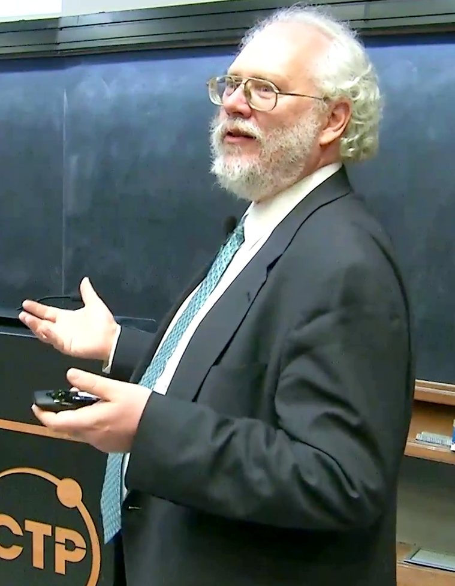
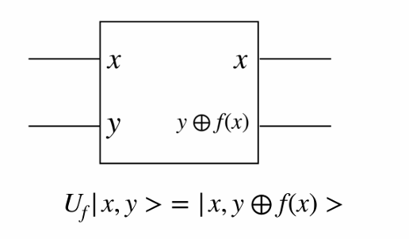
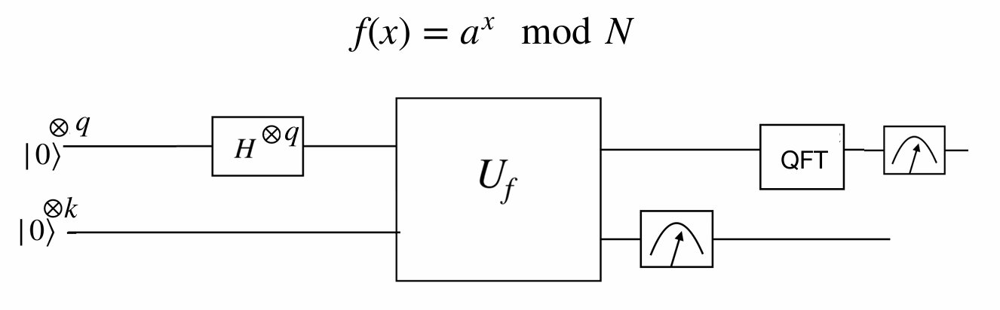
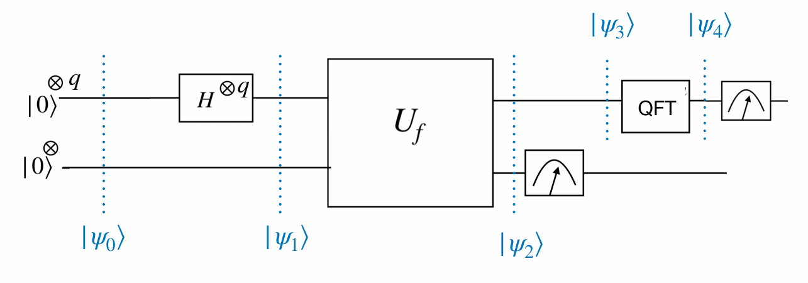
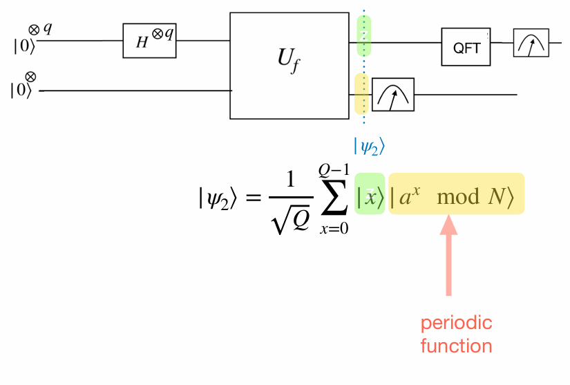
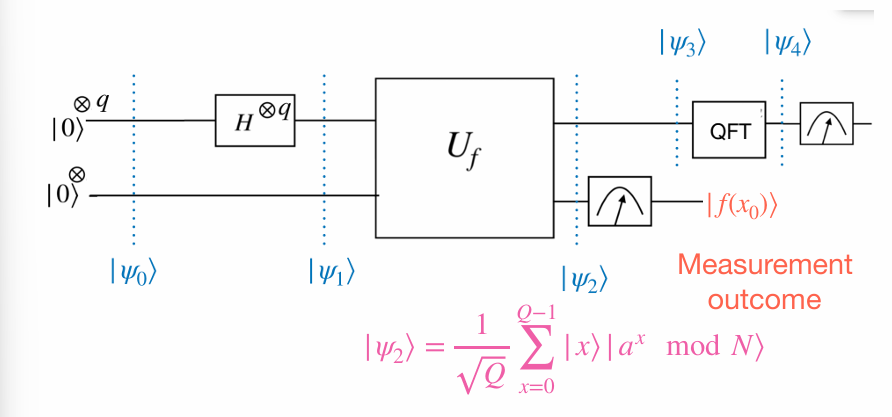
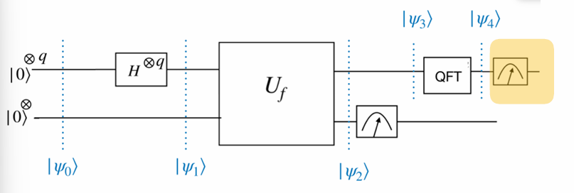

#  Shor’s Algorithm
<!---->


<figure style="float: right; width: 15%;">
  
  <figcaption>Peter Williston Shor (Resource: Wikipedia)</figcaption>
</figure>


Shor's algorithm factorises a number $N$ in $\mathcal{O}((\log N)^3)$ time and $\mathcal{O}(\log N)$ space. This algorithm was devised by Peter Shor in 1994.

This algorithm revolutionised the field of computing, as prime factoring has no polynomial time classical algorithm. An implication was that RSA cryptosystems, which use prime factoring as a key ingredient, would not be safe in the future, with the advent of large quantum computers.

Given an integer $N$, Shor's algorithm is about finding $b$ such that $b^2 \equiv 1 \pmod{N}$.

This idea can be formalised as follows:

```{proposition,label='result'}
Suppose $b^2 \equiv 1 \pmod{N}$ and $b \not\equiv \pm 1 \pmod{N}$. Then
\(\gcd(b + 1, N)\) and \(\gcd(b - 1, N)\) are non-trivial factors of $N$.
```
```{proof}
(_Proof Idea_)\
We are going to use proof by contraditction.
Let $d = \gcd(b - 1, N)$. Then $d$ is a divisor of $N$.

- If $d = N$, then $N \mid (b - 1)$ (contradiction).
- If $d = 1$, then there exist integers $k_1, k_2$ such that:
  \[
  \begin{eqnarray}
  (b - 1)k_1 + Nk_2 &=& 1\\
  (b + 1)(b - 1)k_1 + N(b + 1)k_2 &=& b + 1\\
  (b^2 - 1)k_1 + N(b + 1)k_2 &=& b + 1\\
  \frac{(b^2 - 1)}{N}k_1 + (b + 1)k_2 &=& \frac{b + 1}{N}
  \end{eqnarray}
  \]
  
  
  Since $N|(b-1)$, then \(\frac{(b^2 - 1)}{N}k_1\) is an integer, and \((b+1)k_2\), implies \(\frac{b + 1}{N}\) is an integer.
  This a contrdiction.
```


```{theorem,name='Eulers Theorem'}
Let $\alpha$ be an integer ($\alpha < N$) such that $\gcd(\alpha, N) = 1$. Then there exists some $s$ ($1 < s < N$) such that:
\[
\alpha^s \equiv 1 \pmod{N}.
\]
```
```{proof}
I am not giving you proof here. I will try to write the proof here. But I found good(more detailed) proof [here](https://kconrad.math.uconn.edu/blurbs/ugradnumthy/eulerthm.pdf)
```

If \(N\) is coprime with $a$.
By Euler's Therom, there exist an $S$ such that
\begin{align*}
a^s &\equiv 1 \pmod{N}\\
a^s-1 &\equiv 0 \pmod{N}\\
(a^{s/2}-1)(a^{s/2}-1)& 0\equiv \pmod{N}
\end{align*}

By proposition \@ref(prp:result), if $S$ is even and $a^{s/2} \not\equiv \pm 1 \pmod{N}$ then $\gcd(a^{s/2}+1,N)$ and $\gcd(a^{s/2}-1,N)$ will be the factors of $N$.

Now some problem rises. 

- How do we know whether is $S$ is even or odd?
-  if the condition   $a^{s/2} \not\equiv \pm 1 \pmod{N}$ is satisfied or not

The following propostion answers these questions positively. 

```{proposition}
For a randomly chosen $a$ which is relatively prime to $N$, the
probability of $S$being even and satisfying $a^{s/2} \not\equiv \pm 1 \pmod{N}$ is greater than 50%.

```


```{proof}
See Appendix 4 (Number Theory),
Nielsen & Chuang's book
```

In order to find $S$, a particular function is used. 

A similar oracle for querying functions has already been gone 
through for the Deutsch algorithm

<center>

</center>

Now we try to find a period oa function. It can be easily done with qutum circuit.

For any given $N$,by euler's therm there exist $S$ such that,
\[a^S\equiv 1 \pmod{N}.\]

Now I define functionas folows.
\[f(x)=a^x \pmod{N}\]

**Claim**: $f$ is periodic with $S$, where $S$ in Euler's theorem.\
Note that 
\begin{align*}
f(x_1+x_2)&=a^{x_1+x_2} \pmod{N}\\
&=a^{x_1} a^{x_2} \pmod{N}\\
&=f(x_1)f(x_2)
\end{align*}

Then,

\begin{align*}
f(x+S)&=a^{x+S} \pmod{N}\\
&=a^{x} a^{S} \pmod{N}\\
&=f(x) \cdot 1\pmod{N}\\
&=f(x) \pmod{N}\\
\end{align*}


Therefore,$f$ is periodic with $S$, where $S$ in Euler's theorem.


```{example}
Let $N=15$ and $a=7$, then $f(x)=7^x \pmod{15}$
```

|$x$|$f(x)$|
|:-:|:-:|
|0|1|
|1|7|
|2|4|
|3|13|
|<span style ='color:red'>4</span>|<span style ='color:red'>1</span>|
|5|7|
|6|4|

Then $S=4$

In shor's algrithm has four main steps.

- **Step 1** :Check if $N$ is even, prime or prime power. If yes, exit. 
- **Step 2** : Choose an integer $ɑ<N$ such that $\gcd(a, N) = 1$.
<span style ='color:red'>What if $\gcd(a,N)\neq 1$</span>
- **Step 3** : Find $S$ using a quantum circuit.
- **Step 4** :  If $S$ is odd go to step 2. Otherwise find $\gcd(a^{s/2} \pm 1,N)$.

<center>

</center>

- Choose $q$ subject to 
$N^2 < 2^q < 2N^2$.
- Choose $k$ subject to $N ≥ 2k$.

<center>

</center>

\begin{align*}
|\psi_0\rangle &= |0\rangle^{\otimes q} \, |0\rangle^{\otimes k} \\
|\psi_1\rangle &= \frac{1}{\sqrt{Q}} \sum_{x=0}^{Q-1} |x\rangle \, |0\rangle^{\otimes k} \quad \text{where } 2^q = Q \\
|\psi_2\rangle &= \frac{1}{\sqrt{Q}} \sum_{x=0}^{Q-1} |x\rangle \, |a^x \bmod N\rangle
\end{align*}

<center>

</center>

\begin{align*}
&\text{Let } f \text{ be a periodic function with period } S. \\
&\text{Then for any } x_0 \in \mathbb{Z}, \text{ we have:} \\
&f(x_0) = f(x_0 + S) = f(x_0 + 2S) = f(x_0 + 3S) = \cdots \\\\
&\text{In the case where } S \mid Q \text{ (i.e., } Q = LS \text{ for some integer } L), \text{ we get:} \\
&f(x_0) = f(x_0 + S) = f(x_0 + 2S) = \cdots = f(x_0 + (L - 1)S)
\end{align*}

If the measurement outcome is $f(x_0)$, then the first register collapses to:
\begin{align*}
|\psi_3\rangle = \frac{1}{\sqrt{L}} \sum_{l=0}^{L-1} |x_0 + lS\rangle
\end{align*}

<center>

</center>


```{example}
Consider $N=15$ with the choice $ɑ=7$.
 \[f(x)=7^x \pmod{15}\]


|$x$|$f(x)$|
|:-:|:-:|
|0|1|
|1|7|
|2|4|
|3|13|
|4|1|
|5|7|
|6|4|

\[
|\psi\rangle=\frac{1}{\sqrt{256}}\left( |0\rangle|1\rangle+|1\rangle|7\rangle+|2\rangle|4\rangle+|3\rangle|13\rangle+\cdots |253\rangle |7\rangle+|254\rangle |4\rangle +|255\rangle|13\rangle\right)
\]

Suppose $∣7\rangle$ was obtained as the measurement outcome. Then,


\[
|\psi\rangle=\frac{1}{\sqrt{64}}\left( |1\rangle+|5\rangle+|253\rangle\right)
\]
```
\begin{align*}
|\psi_3\rangle &= \frac{1}{\sqrt{L}} \sum_{l=0}^{L-1} |x_0 + lS\rangle \\\\
\text{Plug } QFT\,|x\rangle &= \frac{1}{\sqrt{Q}} \sum_{y=0}^{Q-1} \omega^{xy} |y\rangle \quad \text{where } \omega = e^{2\pi i / Q} \text{ in to } |\psi_3\rangle \\
|\psi_4\rangle &= \frac{1}{\sqrt{QL}} \sum_{l=0}^{L-1} \sum_{y=0}^{Q-1} \omega^{(x_0 + lS)y} |y\rangle \\
&= \frac{1}{\sqrt{QL}} \sum_{y=0}^{Q-1} \omega^{x_0 y} \left( \sum_{l=0}^{L-1} \omega^{lSy} \right) |y\rangle
\end{align*}


\begin{align*}
|\psi_4\rangle &=
&= \frac{1}{\sqrt{Q}} \sum_{y=0}^{Q-1} \frac{\omega^{x_0 y}}{\sqrt{L}} \left( \sum_{l=0}^{L-1} \omega^{lSy} \right) |y\rangle
\end{align*}


Probability of measing $y$,
\[\frac{1}{QL}\left|\sum_{l=0}^{L-1} \omega^{lSy}\right|^2\]

Let $z=\omega^{Sy}$.
\begin{align*}
\sum_{l=0}^{L-1} \omega^{lSy} 
&= \sum_{l=0}^{L-1} z^l\\
&=1+z+z^2+\cdots+z^{L-1}\\
&\begin{cases}
\frac{1-z^L}{1-z} &\text{ if } z \neq 1\\
L & \text{ if } z=1
\end{cases}
\end{align*}

- **Case 1** : If $S|Q$,
\(L=\frac{S}{Q}\)

Then,
\[z=e^{\frac{2\pi i}{Q}Sy}=e^{\frac{2\pi i}{LS}Sy}=e^{\frac{2\pi i}{L}y}\]
Note that $e^{\frac{2\pi i}{L}}$ is the $L$ th root of unity. $e^{\frac{2\pi i}}{L}$


- **Case 2** :
