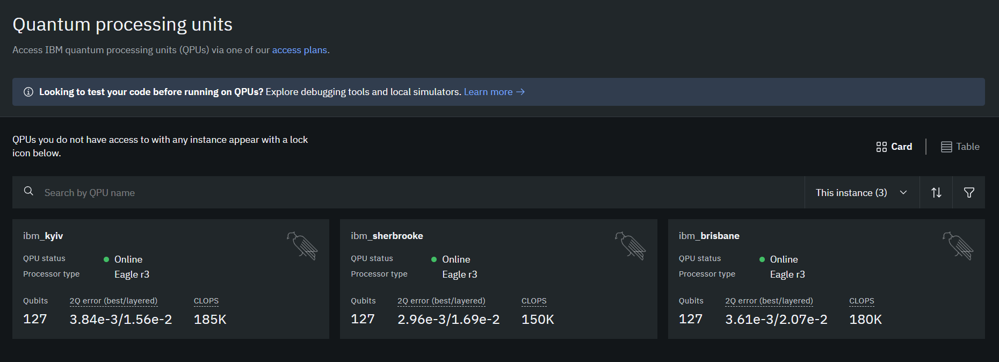
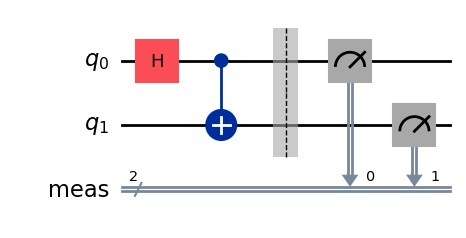
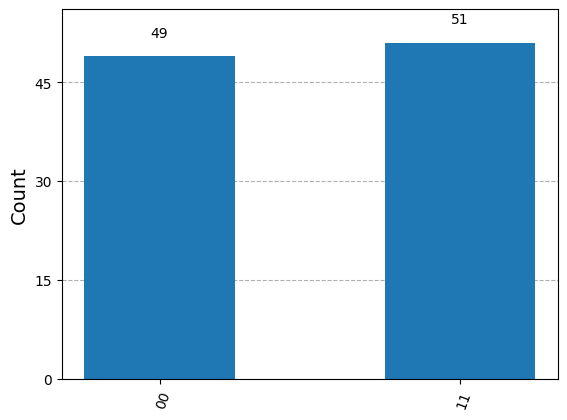
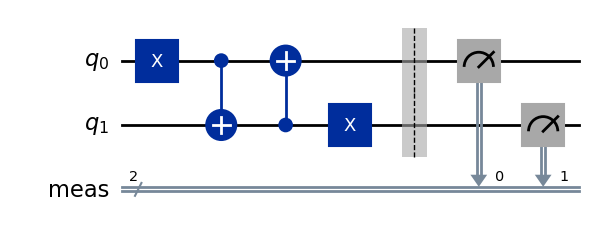
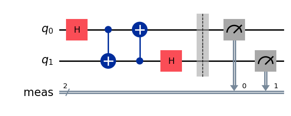

# Quantum Computing with Qiskit

[](https://www.youtube.com/watch?v=P5cGeDKOIP0)

Qiskit is an open-source SDK for working with quantum computers at the level of extended quantum circuits, operators, and primitives.

You can find more details in the following PDF file:

[View the PDF file](fig/qiskit-101.pdf)


**Installing Qiskit and Required Packages**

**Install Qiskit with Visualization Capabilities**
```python
# Uncomment and run the following line to install Qiskit with visualization capabilities
# !pip install qiskit[visualization]
```

**Check Qiskit Version**
```python
import qiskit
print("Qiskit version:", qiskit.__version__)
```

**Install Additional Required Packages**

```python
# Uncomment the following lines to install other required packages

# %pip install qiskit_aer
# %pip install qiskit_ibm_runtime
# %pip install matplotlib
# %pip install qiskit-transpiler-service
```

**Setting Up the IBM Quantum Environment**

Create an account on [IBM Quantum](https://quantum.ibm.com/) and retrieve your API token.




**Configuring the Environment**

```python
from qiskit_ibm_runtime import QiskitRuntimeService

# Initialize the service with your IBM Quantum token
#service = QiskitRuntimeService(
#    channel="ibm_quantum",
#    token="YourActualTokenHere"  # Replace with your actual token
#)

service = QiskitRuntimeService(channel="ibm_quantum",token = "33")

# Access a specific backend
backend = service.backend(name='ibm_brisbane')
print(f"Backend name: {backend.name}")
print(f"Number of qubits: {backend.num_qubits}")
```


Let's try to make the follwing circuits in qiskit.


```{example}
.\

```

```python
#Importing QuantumCircuit from qiskit

from qiskit import QuantumCircuit
# Setting the number of qubits

qc=QuantumCircuit(2)
# Importing necessary packages to simulate results

# Designing the circuit by adding Gates and Measurements

qc.h(0)
qc.cx(0,1)
qc.measure_all()

qc.draw(output='mpl')
```


```python
from qiskit import transpile
from qiskit_aer import AerSimulator

backend = AerSimulator()
transpiled_qc = transpile(qc, backend)
job = backend.run(transpiled_qc, shots=100)    # Shots: Numbers of times the algorithm is run and measured
counts = job.result().get_counts()
print(counts)

# Plotting the results from the simulations

from qiskit.visualization import plot_histogram
plot_histogram(counts)
```



We can verify this result by \@ref(exr:ex-1).

```{example}
.\

```


```python
qc2=QuantumCircuit(2)
qc2.x(0)
qc2.cx(0,1)
qc2.cx(1,0)
qc2.x(1)
qc2.measure_all()
qc2.draw(output='mpl')
```



```python
# Importing necessary packages to simulate results

from qiskit import transpile
from qiskit_aer import AerSimulator

backend = AerSimulator()
transpiled_qc2 = transpile(qc2, backend)
job = backend.run(transpiled_qc2, shots=100)    # Shots: Numbers of times the algorithm is run and measured
counts = job.result().get_counts()
print(counts)

from qiskit.visualization import plot_histogram
plot_histogram(counts)
```


We can verify this result by exercise \@ref(exr:ex-X)

```{example}
.\

```


```python
qc3=QuantumCircuit(2)
qc3.h(0)
qc3.cx(0,1)
qc3.cx(1,0)
qc3.h(1)
qc3.measure_all()
qc3.draw(output='mpl')
```


```python
# Importing necessary packages to simulate results

from qiskit import transpile
from qiskit_aer import AerSimulator

backend = AerSimulator()
transpiled_qc3 = transpile(qc3, backend)
job = backend.run(transpiled_qc3, shots=100)    # Shots: Numbers of times the algorithm is run and measured
counts = job.result().get_counts()
print(counts)

from qiskit.visualization import plot_histogram
plot_histogram(counts)
```


We can verify this result by exercise \@ref(exr:ex-H)

