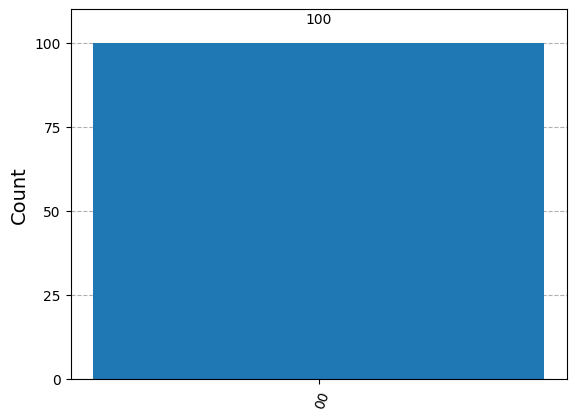

# Quantum Computing with Qiskit

[](https://www.youtube.com/watch?v=P5cGeDKOIP0)

Qiskit is an open-source SDK for working with quantum computers at the level of extended quantum circuits, operators, and primitives.

You can find more details in the following PDF file:

[View the PDF file](fig/qiskit-101.pdf)


**Installing Qiskit and Required Packages**

**Install Qiskit with Visualization Capabilities**
```python
# Uncomment and run the following line to install Qiskit with visualization capabilities
# !pip install qiskit[visualization]
```

**Check Qiskit Version**
```python
import qiskit
print("Qiskit version:", qiskit.__version__)
```

**Install Additional Required Packages**

```python
# Uncomment the following lines to install other required packages

# %pip install qiskit_aer
# %pip install qiskit_ibm_runtime
# %pip install matplotlib
# %pip install qiskit-transpiler-service
```

**Setting Up the IBM Quantum Environment**

Create an account on [IBM Quantum](https://quantum.ibm.com/) and retrieve your API token.


**Configuring the Environment**

```python
from qiskit_ibm_runtime import QiskitRuntimeService

# Initialize the service with your IBM Quantum token
#service = QiskitRuntimeService(
#    channel="ibm_quantum",
#    token="YourActualTokenHere"  # Replace with your actual token
#)

service = QiskitRuntimeService(channel="ibm_quantum",token = "33")

# Access a specific backend
backend = service.backend(name='ibm_brisbane')
print(f"Backend name: {backend.name}")
print(f"Number of qubits: {backend.num_qubits}")
```


Let's try to make the follwing circuits in qiskit.


```{example}
.\

```

```python
#Importing QuantumCircuit from qiskit

from qiskit import QuantumCircuit
# Setting the number of qubits

qc=QuantumCircuit(2)
# Importing necessary packages to simulate results

# Designing the circuit by adding Gates and Measurements

qc.h(0)
qc.cx(0,1)
qc.measure_all()

qc.draw(output='mpl')
```


```python
from qiskit import transpile
from qiskit_aer import AerSimulator

backend = AerSimulator()
transpiled_qc = transpile(qc, backend)
job = backend.run(transpiled_qc, shots=100)    # Shots: Numbers of times the algorithm is run and measured
counts = job.result().get_counts()
print(counts)

# Plotting the results from the simulations

from qiskit.visualization import plot_histogram
plot_histogram(counts)
```


We can verify this result by \@ref(exr:ex-1).

```{example}
.\

```


```python
qc2=QuantumCircuit(2)
qc2.x(0)
qc2.cx(0,1)
qc2.cx(1,0)
qc2.x(1)
qc2.measure_all()
qc2.draw(output='mpl')
```


```python
# Importing necessary packages to simulate results

from qiskit import transpile
from qiskit_aer import AerSimulator

backend = AerSimulator()
transpiled_qc2 = transpile(qc2, backend)
job = backend.run(transpiled_qc2, shots=100)    # Shots: Numbers of times the algorithm is run and measured
counts = job.result().get_counts()
print(counts)

from qiskit.visualization import plot_histogram
plot_histogram(counts)
```


We can verify this result by exercise \@ref(exr:ex-X)

```{example}
.\

```


```python
qc3=QuantumCircuit(2)
qc3.h(0)
qc3.cx(0,1)
qc3.cx(1,0)
qc3.h(1)
qc3.measure_all()
qc3.draw(output='mpl')
```


```python
# Importing necessary packages to simulate results

from qiskit import transpile
from qiskit_aer import AerSimulator

backend = AerSimulator()
transpiled_qc3 = transpile(qc3, backend)
job = backend.run(transpiled_qc3, shots=100)    # Shots: Numbers of times the algorithm is run and measured
counts = job.result().get_counts()
print(counts)

from qiskit.visualization import plot_histogram
plot_histogram(counts)
```



We can verify this result by exercise \@ref(exr:ex-H)


```{example}
The circuit implementation of QFT on 4 qubits

```

```python
from qiskit import QuantumCircuit
import numpy as np

def controlled_rotation(qc, control, target, k):
    """
    Adds a controlled rotation gate R_k to the quantum circuit.

    Parameters:
    qc (QuantumCircuit): The quantum circuit to which the gate is applied.
    control (int): The control qubit index.
    target (int): The target qubit index.
    k (int): The exponent determining the angle of rotation (2π / 2^k).
    """
    # Calculate the rotation angle (2π divided by 2^k)
    angle = 2 * np.pi / (2 ** k)

    # Apply the controlled-phase gate (controlled-R_k)
    qc.cp(angle, control, target)

# Create a 4-qubit quantum circuit
qcF = QuantumCircuit(4)

# Apply a Hadamard gate to qubit 0 to create a superposition
qcF.h(0)  # Hadamard gate on qubit 0

# Apply controlled rotations with qubit 0 as the target
controlled_rotation(qcF, control=1, target=0, k=2)  # Controlled R_2 gate
controlled_rotation(qcF, control=2, target=0, k=3)  # Controlled R_3 gate
controlled_rotation(qcF, control=3, target=0, k=4)  # Controlled R_4 gate
qcF.barrier()  # Add a barrier to separate different sections of the circuit

# Apply a Hadamard gate to qubit 1
qcF.h(1)  # Hadamard gate on qubit 1

# Apply controlled rotations with qubit 1 as the target
controlled_rotation(qcF, control=2, target=1, k=2)  # Controlled R_2 gate
controlled_rotation(qcF, control=3, target=1, k=3)  # Controlled R_3 gate
qcF.barrier()  # Barrier after operations on qubit 1

# Apply a Hadamard gate to qubit 2
qcF.h(2)  # Hadamard gate on qubit 2

# Apply a controlled rotation with qubit 2 as the target
controlled_rotation(qcF, control=3, target=2, k=2)  # Controlled R_2 gate
qcF.barrier()  # Barrier after operations on qubit 2

# Apply a Hadamard gate to qubit 3
qcF.h(3)  # Hadamard gate on qubit 3
qcF.barrier()  # Barrier after operations on qubit 3


# Swap qubits to reverse the order (commonly done in quantum algorithms like QFT)
qcF.swap(0, 3)
qcF.swap(1, 2)

# Measure all qubits
qcF.measure_all()

# Print the quantum circuit
print(qcF)

# Draw the quantum circuit diagram
qcF.draw(output='mpl')

```

**Output**:

  ```
        ┌───┐                            ░                         ░      »
   q_0: ┤ H ├─■────────■────────■────────░─────────────────────────░──────»
        └───┘ │P(π/2)  │        │        ░ ┌───┐                   ░      »
   q_1: ──────■────────┼────────┼────────░─┤ H ├─■────────■────────░──────»
                       │P(π/4)  │        ░ └───┘ │P(π/2)  │        ░ ┌───┐»
   q_2: ───────────────■────────┼────────░───────■────────┼────────░─┤ H ├»
                                │P(π/8)  ░                │P(π/4)  ░ └───┘»
   q_3: ────────────────────────■────────░────────────────■────────░──────»
                                         ░                         ░      »
meas: 4/══════════════════════════════════════════════════════════════════»
                                                                          »
«                  ░       ░        ░ ┌─┐         
«   q_0: ──────────░───────░──X─────░─┤M├─────────
«                  ░       ░  │     ░ └╥┘┌─┐      
«   q_1: ──────────░───────░──┼──X──░──╫─┤M├──────
«                  ░       ░  │  │  ░  ║ └╥┘┌─┐   
«   q_2: ─■────────░───────░──┼──X──░──╫──╫─┤M├───
«         │P(π/2)  ░ ┌───┐ ░  │     ░  ║  ║ └╥┘┌─┐
«   q_3: ─■────────░─┤ H ├─░──X─────░──╫──╫──╫─┤M├
«                  ░ └───┘ ░        ░  ║  ║  ║ └╥┘
«meas: 4/══════════════════════════════╩══╩══╩══╩═
```


Similarly 2-bit Fourier transformational circuit can be get as follows.

We are going to verify the result in exercise \@ref(exr:ex-F) that we got earlier.

- **$|\psi_1 \rangle =|00\rangle =\begin{pmatrix}1\\0\\0\\0\end{pmatrix}$**
    
    ```python
    from qiskit import QuantumCircuit
    import numpy as np
    
    def controlled_rotation(qc, control, target, k):
        """
        Adds a controlled rotation gate R_k to the quantum circuit.
    
        Parameters:
        qc (QuantumCircuit): The quantum circuit to which the gate is applied.
        control (int): The control qubit index.
        target (int): The target qubit index.
        k (int): The exponent determining the angle of rotation (2π / 2^k).
        """
        # Calculate the rotation angle (2π divided by 2^k)
        angle = 2 * np.pi / (2 ** k)
    
        # Apply the controlled-phase gate (controlled-R_k)
        qc.cp(angle, control, target)
    
    # Create a 2-qubit quantum circuit (for |00⟩)
    qcF = QuantumCircuit(2)
    
    # No need to initialize; the default state is |00⟩ in Qiskit
    
    # Apply a Hadamard gate to qubit 0 to create a superposition
    qcF.h(0)  # Hadamard gate on qubit 0
    
    # Apply controlled rotations with qubit 0 as the target
    controlled_rotation(qcF, control=1, target=0, k=2)  # Controlled R_2 gate
    qcF.barrier()  # Add a barrier to separate different sections of the circuit
    
    # Apply a Hadamard gate to qubit 1
    qcF.h(1)  # Hadamard gate on qubit 1
    qcF.barrier()  # Barrier after operations on qubit 1
    
    # Swap qubits to reverse the order (commonly done in quantum algorithms like QFT)
    qcF.swap(0, 1)
    
    # Measure all qubits
    qcF.measure_all()
    
    # Print the quantum circuit
    print(qcF)
    
    # Draw the quantum circuit diagram (requires 'matplotlib' to be installed)
    qcF.draw(output='mpl')
    
    ```
    
    **Output**: 
    
    ```
            ┌───┐          ░       ░     ░ ┌─┐   
       q_0: ┤ H ├─■────────░───────░──X──░─┤M├───
            └───┘ │P(π/2)  ░ ┌───┐ ░  │  ░ └╥┘┌─┐
       q_1: ──────■────────░─┤ H ├─░──X──░──╫─┤M├
                           ░ └───┘ ░     ░  ║ └╥┘
    meas: 2/════════════════════════════════╩══╩═
                                            0  1 
    ```
    
    
    
    
    ```python
    # Importing necessary packages to simulate results
    
    from qiskit import transpile
    from qiskit_aer import AerSimulator
    
    backend = AerSimulator()
    transpiled_qcF = transpile(qcF, backend)
    job = backend.run(transpiled_qcF, shots=10000)    # Shots: Numbers of times the algorithm is run and measured
    counts = job.result().get_counts()
    print(counts)
    
    from qiskit.visualization import plot_histogram
    plot_histogram(counts)
    ```
    
    

- **$|\psi_2 \rangle =|01\rangle =\begin{pmatrix}0\\1\\0\\0\end{pmatrix}$**

  ```python
  from qiskit import QuantumCircuit
  import numpy as np
  
  def controlled_rotation(qc, control, target, k):
      """
      Adds a controlled rotation gate R_k to the quantum circuit.
  
      Parameters:
      qc (QuantumCircuit): The quantum circuit to which the gate is applied.
      control (int): The control qubit index.
      target (int): The target qubit index.
      k (int): The exponent determining the angle of rotation (2π / 2^k).
      """
      # Calculate the rotation angle (2π divided by 2^k)
      angle = 2 * np.pi / (2 ** k)
  
      # Apply the controlled-phase gate (controlled-R_k)
      qc.cp(angle, control, target)
  
  # Create a 2-qubit quantum circuit
  qcF = QuantumCircuit(2)
  qcF.initialize([0,1,0,0],[0,1]) #   (for |01>=(1,0,0,0)^T)
  
  
  
  # Apply a Hadamard gate to qubit 0 to create a superposition
  qcF.h(0)  # Hadamard gate on qubit 0
  
  # Apply controlled rotations with qubit 0 as the target
  controlled_rotation(qcF, control=1, target=0, k=2)  # Controlled R_2 gate
  qcF.barrier()  # Add a barrier to separate different sections of the circuit
  
  # Apply a Hadamard gate to qubit 1
  qcF.h(1)  # Hadamard gate on qubit 1
  qcF.barrier()  # Barrier after operations on qubit 1
  
  # Swap qubits to reverse the order (commonly done in quantum algorithms like QFT)
  qcF.swap(0, 1)
  
  # Measure all qubits
  qcF.measure_all()
  
  # Print the quantum circuit
  print(qcF)
  
  # Draw the quantum circuit diagram (requires 'matplotlib' to be installed)
  qcF.draw(output='mpl')
  ```
  
  
  ```python
  # Importing necessary packages to simulate results
  
  from qiskit import transpile
  from qiskit_aer import AerSimulator
  
  backend = AerSimulator()
  transpiled_qcF = transpile(qcF, backend)
  job = backend.run(transpiled_qcF, shots=10000)    # Shots: Numbers of times the algorithm is run and measured
  counts = job.result().get_counts()
  print(counts)
  
  from qiskit.visualization import plot_histogram
  plot_histogram(counts)
  ```
  
  
  

- **$|\psi_3 \rangle =\frac{1}{2}\big(|00\rangle+|01\rangle+|10\rangle+|11\rangle\big) =\frac{1}{2}\begin{pmatrix}1\\1\\1\\1\end{pmatrix}$**
  
  ```python
  from qiskit import QuantumCircuit
  import numpy as np
  
  def controlled_rotation(qc, control, target, k):
      """
      Adds a controlled rotation gate R_k to the quantum circuit.
  
      Parameters:
      qc (QuantumCircuit): The quantum circuit to which the gate is applied.
      control (int): The control qubit index.
      target (int): The target qubit index.
      k (int): The exponent determining the angle of rotation (2π / 2^k).
      """
      # Calculate the rotation angle (2π divided by 2^k)
      angle = 2 * np.pi / (2 ** k)
  
      # Apply the controlled-phase gate (controlled-R_k)
      qc.cp(angle, control, target)
  
  # Create a 2-qubit quantum circuit 
  qcF = QuantumCircuit(2)
  qcF.initialize([0.5,0.5,0.5,0.5],[0,1]) (for 1/2(|00⟩+|01⟩+|10⟩+|11⟩=1/2(1,1,1,1)^T))
  
  
  
  # Apply a Hadamard gate to qubit 0 to create a superposition
  qcF.h(0)  # Hadamard gate on qubit 0
  
  # Apply controlled rotations with qubit 0 as the target
  controlled_rotation(qcF, control=1, target=0, k=2)  # Controlled R_2 gate
  qcF.barrier()  # Add a barrier to separate different sections of the circuit
  
  # Apply a Hadamard gate to qubit 1
  qcF.h(1)  # Hadamard gate on qubit 1
  qcF.barrier()  # Barrier after operations on qubit 1
  
  # Swap qubits to reverse the order (commonly done in quantum algorithms like QFT)
  qcF.swap(0, 1)
  
  # Measure all qubits
  qcF.measure_all()
  
  # Print the quantum circuit
  print(qcF)
  
  # Draw the quantum circuit diagram (requires 'matplotlib' to be installed)
  qcF.draw(output='mpl')
  
  ```
  
  **Output**
  
  ```
          ┌──────────────────────────────┐┌───┐          ░       ░     ░ ┌─┐   
     q_0: ┤0                             ├┤ H ├─■────────░───────░──X──░─┤M├───
          │  Initialize(0.5,0.5,0.5,0.5) │└───┘ │P(π/2)  ░ ┌───┐ ░  │  ░ └╥┘┌─┐
     q_1: ┤1                             ├──────■────────░─┤ H ├─░──X──░──╫─┤M├
          └──────────────────────────────┘               ░ └───┘ ░     ░  ║ └╥┘
  meas: 2/════════════════════════════════════════════════════════════════╩══╩═
                                                                          0  1 
  ```
  
  
  
  
  ```python
  # Importing necessary packages to simulate results
  
  from qiskit import transpile
  from qiskit_aer import AerSimulator
  
  backend = AerSimulator()
  transpiled_qcF = transpile(qcF, backend)
  job = backend.run(transpiled_qcF, shots=10000)    # Shots: Numbers of times the algorithm is run and measured
  counts = job.result().get_counts()
  print(counts)
  
  from qiskit.visualization import plot_histogram
  plot_histogram(counts)
  ```
  
  
  
  