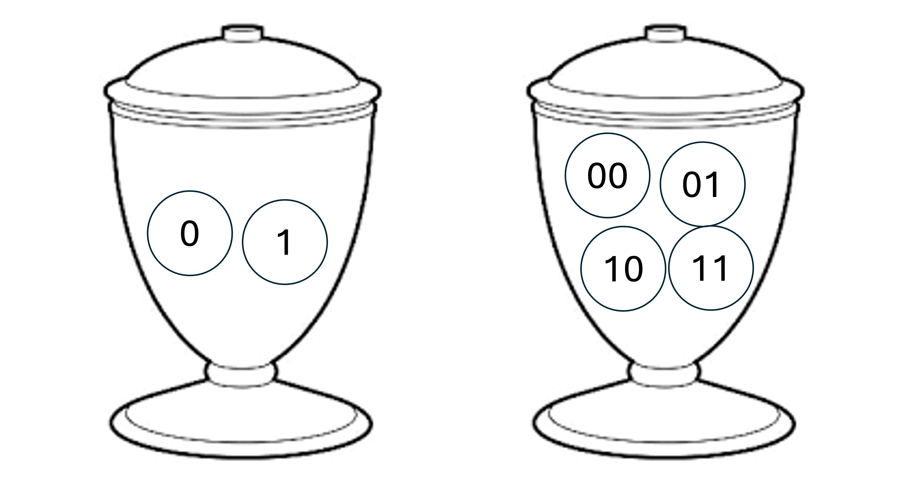

--- 
title: 'Introduction to Quantum Computing '
author: "Ashan Jayamal"
date: "`r Sys.Date()`"
site: bookdown::bookdown_site
documentclass: book
bibliography:
- book.bib
- packages.bib
url: "https://ashanjayamal.github.io/Quantum-Computing/"
description: |
  This is a minimal example of using the bookdown package to write a book.
  set in the _output.yml file.
  The HTML output format for this example is bookdown::gitbook,
link-citations: true
github-repo: "rstudio/bookdown-demo"

  
---


# Quantum Computing: A Journey into the Atomic World


As circuit components continue to shrink, reaching the atomic realm of energy and matter, the influence of quantum effects has become increasingly significant. Rather than viewing these effects as challenges, researchers recognized their potential to enable more efficient computations.

In the early 1980s, both Paul Benioff and Richard Feynman independently proposed quantum models of computation. These pioneering ideas demonstrated how quantum mechanics could be applied to computing, laying the groundwork for a new paradigm.

The limitations of classical computers, bound by conventional models, drove researchers to explore quantum computing more deeply. Over the decades, this unconventional approach has garnered significant attention due to remarkable theoretical and experimental advancements.

Quantum computing aims to solve complex computational problems efficiently by harnessing the power of quantum effects, such as superposition and entanglement. Today, it represents a bold step forward in the quest for revolutionary technologies that transcend the boundaries of classical computation.


## Basic Defnitions and Notations

A discussion on quantum computers requires working with the decimal and binary representations of integers, some bit operations, and familiarity with the properties of the tensor product. We describe here the necessary concepts and the notation, so that the reader can come back to this section at any time to clarify symbols.

```{definition}
Given two vector spaces $V$ and $W$ over a field $K$ with bases $e_1, \dots, e_m$ and $f_1, \dots, f_n$, respectively, the tensor product $V \otimes W$ is another vector space over $K$ of dimension $mn$. The tensor product space is equipped with a bilinear operation $\otimes : V \times W \to V \otimes W$. The vector space $V \otimes W$ has basis $e_i \otimes f_j$ where $i = 1, \dots, m$ and $j = 1, \dots, n$.
```

If the origin vector spaces are complex Euclidean spaces of the form $\mathbb{C}^n$, and we choose the standard basis (consisting of the orthonormal vectors that have a $1$ in a single position and $0$ elsewhere) in the origin vector spaces, then the tensor product is none other than the Kronecker product, which is itself a generalization of the outer product. This is formalized next.

```{definition}
Given $A \in \mathbb{C}^{m \times n}$ and $B \in \mathbb{C}^{p \times q}$, the Kronecker product $A \otimes B$ is the matrix $D \in \mathbb{C}^{mp \times nq}$ defined as


\[
D := A \otimes B =
\begin{bmatrix}
a_{11}B & \dots & a_{1n}B \\
a_{21}B & \dots & a_{2n}B \\
\vdots & \ddots & \vdots \\
a_{m1}B & \dots & a_{mn}B
\end{bmatrix}.
\]


If we choose the standard basis over the vector spaces $\mathbb{C}^{m \times n}$ and $\mathbb{C}^{p \times q}$, then the bilinear operation of the tensor product $\mathbb{C}^{m \times n} \otimes \mathbb{C}^{p \times q}$ is simply the Kronecker product.
```

```{example}
We provide an example of the tensor product for normalized vectors, which will link this concept to probability distributions and will hopefully provide a better understanding of some of the future material.

Consider two independent discrete random variables \( X \) and \( Y \) that describe the probability of extracting numbers from two urns. The first urn contains the numbers \( 0 \) and \( 1 \); the second urn contains the numbers \( 00, 01, 10, \) and \( 11 \). 



Assume that the extraction mechanism is biased and therefore the outcomes do not have equal probability. The outcome probabilities are given below, and for convenience, we define two vectors containing them:
\[
x = \begin{pmatrix}
\Pr(X = 0) \\
\Pr(X = 1)
\end{pmatrix}
=
\begin{pmatrix}
0.25 \\
0.75
\end{pmatrix},
\quad
y = \begin{pmatrix}
\Pr(Y = 00) \\
\Pr(Y = 01) \\
\Pr(Y = 10) \\
\Pr(Y = 11)
\end{pmatrix}
=
\begin{pmatrix}
0.2 \\
0.2 \\
0.2 \\
0.4
\end{pmatrix}.
\]

Notice that because each vector contains probabilities for all possible respective outcomes, the vectors are normalized so that their entries sum up to \( 1 \). 

The probabilities for simultaneously extracting numbers from the two urns are given by the tensor product \( x \otimes y \):
\[
x \otimes y =
\begin{pmatrix}
0.25 \\
0.75
\end{pmatrix}
\otimes
\begin{pmatrix}
0.2 \\
0.2 \\
0.2 \\
0.4
\end{pmatrix}
=
\begin{pmatrix}
0.25 \\
0.75
\end{pmatrix}
\cdot
\begin{pmatrix}
0.2 &
0.2 &
0.2 &
0.4
\end{pmatrix}
=
\begin{pmatrix}
0.05 \\
0.05 \\
0.05 \\
0.10 \\
0.15 \\
0.15 \\
0.15 \\
0.30
\end{pmatrix}.
\]

Equivalently, these probabilities can be written as:
\[
x \otimes y =
\begin{pmatrix}
\Pr(X = 0)\Pr(Y = 00) \\
\Pr(X = 0)\Pr(Y = 01) \\
\Pr(X = 0)\Pr(Y = 10) \\
\Pr(X = 0)\Pr(Y = 11) \\
\Pr(X = 1)\Pr(Y = 00) \\
\Pr(X = 1)\Pr(Y = 01) \\
\Pr(X = 1)\Pr(Y = 10) \\
\Pr(X = 1)\Pr(Y = 11)
\end{pmatrix}
=
\begin{pmatrix}
\Pr(X = 0, Y = 00) \\
\Pr(X = 0, Y = 01) \\
\Pr(X = 0, Y = 10) \\
\Pr(X = 0, Y = 11) \\
\Pr(X = 1, Y = 00) \\
\Pr(X = 1, Y = 01) \\
\Pr(X = 1, Y = 10) \\
\Pr(X = 1, Y = 11)
\end{pmatrix}.
\]

The last equality is due to the fact that \( X \) and \( Y \) are independent. The vector \( x \otimes y \) is also normalized, which is easy to verify algebraically.
```


```{proposition}
Let $A, B \in \mathbb{C}^{m \times m}$ and $C, D \in \mathbb{C}^{n \times n}$ be linear transformations on $V$ and $W$, respectively. Let $u, v \in \mathbb{C}^m$, $w, x \in \mathbb{C}^n$, and $a, b \in \mathbb{C}$. The tensor product satisfies the following properties:
  
- $(A \otimes C)(B \otimes D) = (AB) \otimes (CD).$
- $(A \otimes C)(u \otimes w) = (Au) \otimes (Cw).$
- $(u + v) \otimes w = (u \otimes w) + (v \otimes w).$
- $u \otimes (w + x) = (u \otimes w) + (u \otimes x).$
- $(au) \otimes (bw) = ab(u \otimes w).$
- $(A \otimes C)^\dagger = A^\dagger \otimes C^\dagger.$
```
Above and in what follows, the notation $A^\dagger$ denotes the conjugate transpose of $A$, which is the matrix defined as $A^\dagger := \overline{A}^\top$. 

Given a matrix $A$, the notation $A^{\otimes n}$ indicates the tensor product of $A$ with itself $n$ times, and the same notation will be used for vector spaces $S$:


\[
A^{\otimes n} := \underbrace{A \otimes A \otimes \dots \otimes A}_{n \text{ times}},
\]


\[
S^{\otimes n} := \underbrace{S \otimes S \otimes \dots \otimes S}_{n \text{ times}}.
\]


